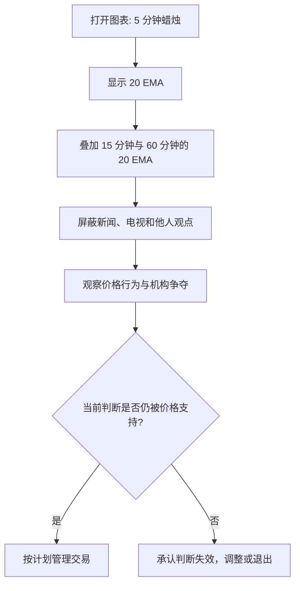

# P02 我的设置

## 一句话摘要

Brooks 的核心设置很朴素：少用工具、屏蔽干扰、只读价格行为，并始终接受多数交易判断只落在约 40%-60% 概率区间内。

## 材料类型与适用边界

- 类型: 技术分析 / 价格行为 / 交易心理 / 交易流程
- 市场/品种: 示例提到 EWZ、PBR Petrobras、E-mini；核心观点面向日内价格行为交易
- 周期/频率: 重点是 5 分钟蜡烛图，同时参考 15 分钟和 60 分钟级别的 20 EMA
- 适用前提: 交易者需要能独立读图、接受不确定性，并有足够经验管理进出场
- 失效条件: 把 20 EMA 或 5 分钟图当作机械信号；忽略市场环境、成本、滑点和执行风险；把讲师观点当成确定性预测

## 核心概念

### 1. 极简图表设置

来源观点:

- 使用普通笔记本电脑即可。
- 主图为 5 分钟蜡烛图。
- 使用 20 bar EMA，不使用其他指标。
- 在 5 分钟图上也会显示来自 15 分钟图和 60 分钟图的 20 bar EMA，用来观察更高周期的均线位置。

整理推断:

- 这里的重点不是 20 EMA 本身，而是减少图表噪声，让注意力回到价格结构、趋势、震荡、突破和陷阱。
- 多周期 EMA 的作用是把更高周期交易者可能关注的位置投射到当前执行周期。

### 2. 屏蔽新闻和观点干扰

来源观点:

- 交易时关百叶窗、不接电话、不看电视。
- 会知道 FOMC 等重大报告发生的时间，但报告刚出时通常至少几秒到几分钟不交易。
- 电视评论员只代表一方观点，不能告诉你几百家活跃机构如何真正处理报告。
- 判断报告影响的方式是看图表，而不是听评论。

整理推断:

- 新闻不是被完全否定，而是不能替代价格反应。
- 对日内交易者来说，“报告是什么”不如“机构资金如何用价格回应报告”重要。

### 3. 60-40 规则

来源观点:

- 市场世界多数判断只有约 40%-60% 的概率。
- 如果你认为某件事显著高于 60% 或低于 40%，很可能过度自信。
- 市场大体保持平衡：如果一边过重，价格会被拉回更均衡的位置。
- 完美交易不存在，因为如果一方“完美正确”，另一方机构就必须“完美错误”，而市场通常由强势参与者在两边竞争。

整理推断:

- 60-40 不是精确统计结论，而是一种反过度自信的交易心智模型。
- 它要求交易者随证据变化快速修正观点，而不是维护面子。

| 观点 | 学习含义 | 常见误读 |
|---|---|---|
| 多数判断在 40%-60% | 任何判断都需要止损、退出和反手预案 | “60% 就一定能赚钱” |
| 最好分析也常只有 60%-70% | 胜率不是唯一核心，管理和风险更重要 | “高手总能看准方向” |
| 市场会均值回归 | 极端确定性会吸引反向机构参与 | “偏离均值就马上反转” |
| 完美交易不存在 | 交易永远有人在对手方 | “某个形态必胜” |

## 图表与示意

图 1: 概念流程图，按来源内容重构；不是市场数据。

## 交易规则或判断流程

来源中的流程倾向:

1. 保持图表简单。
2. 只从价格行为判断市场如何回应信息。
3. 不因新闻标题、电视观点或他人确信而改变交易计划。
4. 使用 60-40 规则约束信念强度。
5. 如果发现自己被震出好交易，但市场再次给出有效信号，可以重新进入，不必尴尬。

学习版检查表:

| 问题 | 目的 |
|---|---|
| 我现在是在读价格，还是在复述新闻观点? | 防止外部叙事替代图表 |
| 我是否把一个判断看得超过 60%-70% 确定? | 防止过度自信 |
| 如果完全相反的情况发生，我的退出计划是什么? | 接受 40% 反向概率 |
| 如果我被震出但信号重新出现，我能否重新进入? | 防止情绪化懊恼 |

## 风险、反例与常见误读

- 20 EMA 不是自动买卖信号，只是观察结构的辅助线。
- 价格行为可以被很多人看见，但仍然难以交易，因为执行、止损、重新入场和情绪管理很难。
- 高胜率常来自剥头皮等小目标策略，但小目标也会放大成本、滑点和执行要求。
- “市场总在 40%-60%”不等于没有趋势。强突破时某一方会暂时明显占优。
- “不看新闻”不等于不知道事件时间。重大报告前后仍要考虑波动和滑点。

## 可复盘问题

- 今天我的图表是否过度复杂?
- 我是否因为电视、社交媒体或他人观点提前形成偏见?
- 我是否把一个普通信号想象成“必然会发生”?
- 我是否能在发现判断错误时快速改变观点?
- 我是否因为被震出好交易而错过重新进入?

## 待验证假设

- 在我的交易品种和周期上，20 EMA 是否确实能帮助识别更高周期参与者关注的位置?
- 重大新闻发布后等待几秒到几分钟，是否能改善执行质量和降低滑点?
- 我的交易记录中，主观判断的真实胜率是否落在 40%-60% 或 60%-70% 区间?
- 被震出后重新进入的规则，是否在成本后仍有正期望?
