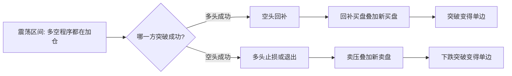
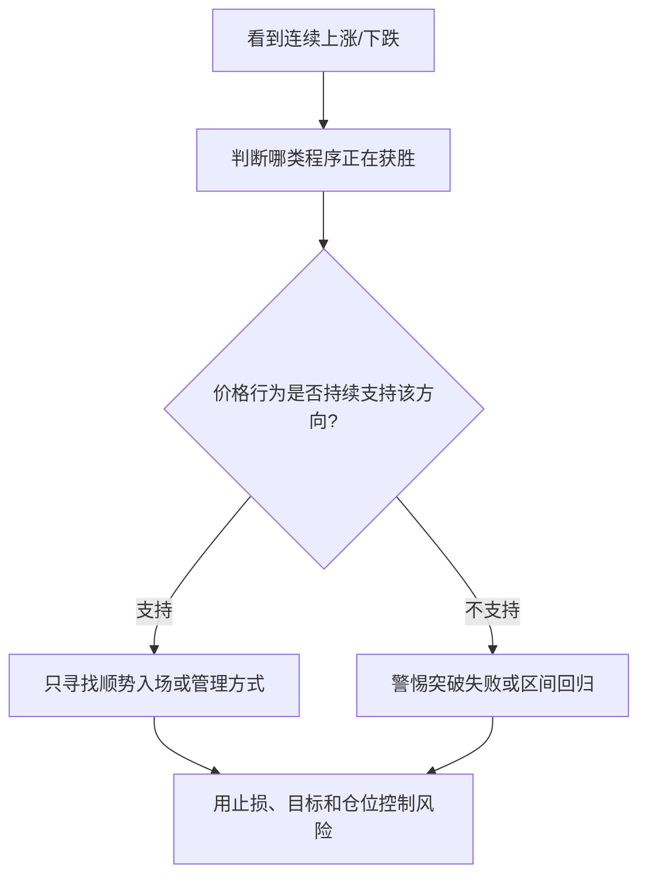

# P03 程序化交易

## 一句话摘要

Brooks 认为市场主要由机构和程序化交易推动；散户不需要猜谁在操纵价格，而应通过价格行为判断哪一方程序正在控制市场。

## 材料类型与适用边界

- 类型: 市场微观结构 / 程序化交易 / 高频交易 / 价格行为
- 市场/品种: 重点示例为 E-mini，也提到股票市场和大型机构
- 周期/频率: 日内交易，尤其是 5 分钟图、紧密震荡区间、突破和剥头皮
- 数据来源: 本地视频转录 `transcripts/P03_en/transcript.txt`
- 适用前提: 交易者用价格行为观察资金方向，而不是尝试预测机构内部算法
- 失效条件: 把“顺着程序方向”简化成追涨杀跌；忽略假突破、交易成本、滑点和流动性

## 核心概念

### 1. 程序控制市场方向

来源观点:

- 市场由程序化交易控制。
- 如果多头程序控制市场，交易者只有做多才容易赚钱；如果空头程序控制市场，就应寻找卖出方向。
- 程序无法隐藏行为，因为价格行为会展示资金流向。
- 如果市场一根接一根上涨，多头买入程序正在获胜，卖出程序正在失败。

整理推断:

- 课程强调的是“跟随可见的价格行为”，不是猜测某个机构的算法。
- 程序化交易的存在反而让价格行为更重要，因为程序的行为最终必须体现在成交和价格上。

### 2. 紧密震荡区间中的高频剥头皮

来源观点:

- 即使 E-mini 在极窄区间内运行一两个小时，成交量仍然很大。
- 高频程序可能在区间中轴下方买入，跌一两个 tick 加仓，回到中轴附近退出；反过来在中轴上方卖出。
- 目标可能只是 1-2 tick。

整理推断:

- 震荡区间中大量成交不一定意味着方向性强，可能只是高频策略在做微小价差。
- 交易者不应把每个成交量放大都解释为趋势即将启动。

### 3. 突破时一方会暂时压倒另一方

来源观点:

- 多头程序试图制造向上突破，空头程序试图制造向下突破。
- 最终一方获胜，另一方回补。
- 如果多头成功制造强多头突破，原先在区间做空的空头买回头寸，进一步增加买盘。
- 空头暂时退场后，市场需要涨到更高价格，才会找到愿意重新做空的价格。

图 1: 概念流程图，按来源内容重构；不是市场数据。

### 4. 散户不会因为自己的订单“推动市场”

来源观点:

- 散户常担心自己的买单会让市场跳涨，卖单会让市场下跌，或者止损会被市场专门扫掉。
- Brooks 认为这不成立。价格只能到达有机构愿意交易的位置。
- 即使某次 E-mini 突破只成交 3 张合约，也应假设这是机构行为，而不是家庭交易者推动。
- 机构可能用小单触发市场想法，再用更大单反向处理。

整理推断:

- “市场盯着我的止损”通常是错觉；更合理的解释是止损位置与许多市场参与者共同关注的位置重合。
- 对散户更重要的是把止损放在逻辑失效处，而不是试图躲避想象中的猎杀。

### 5. 高频交易的角色

来源观点:

- 高频交易公司是程序化交易公司的一种。
- 在主要市场中，它们可能贡献 50%-75% 的交易量；课程中也给出“约 70% 高频、25% 其他机构、5% 散户”的粗略框架。
- 高频交易关注 latency，即交易发生到系统看到交易之间的延迟。
- 它们靠非常小的利润交易大量次数，通常不显著决定市场方向。
- 许多高频公司也亏钱，只有最优秀的公司能达到非常高的收益。

示例计算:

| 假设 | 数值 |
|---|---:|
| 每日交易次数 | 10,000,000 |
| 每次交易规模 | 100 shares |
| 胜率 | 55% |
| 每股盈利/亏损 | 1 cent |
| 盈利交易 | 5,500,000 个 penny |
| 亏损交易 | 4,500,000 个 penny |
| 示例日净利润 | 约 1,000,000 美元 |
| 示例年净利润 | 约 200,000,000 美元 |

注意: 这是课程中的教学例子，不是行业平均收益，也没有扣除费用、基础设施成本和风险。

## 图表与示意

图 2: 程序化交易背景下的价格行为读取流程；概念图，不是交易系统。

## 交易规则或判断流程

学习版流程:

1. 先判断市场是否处于区间、突破、趋势或假突破环境。
2. 如果价格连续向一个方向推进，承认该方向程序正在控制市场。
3. 不要因为“我买了会推涨/我卖了会砸盘”而赋予自己过大影响。
4. 把注意力放在机构愿意交易的价格，而非个人订单是否被看见。
5. 高频交易是背景结构，不应成为亏损借口。
6. 如果不能从其他优秀交易者手中拿到钱，问题更可能在自己的技能、规则或执行上。

## 风险、反例与常见误读

- “多头程序控制”不是追高理由。突破后仍可能失败，必须定义失效条件。
- 高频交易贡献大量成交量，不等于它决定方向。
- 散户不能推动市场，不等于散户不会在拥挤位置被集体止损。
- “机构不是针对你”不等于市场温和。机构之间的竞争本身就足够激烈。
- 高频收益示例没有说明成本、合规、基础设施、库存风险和尾部风险。

## 可复盘问题

- 当前价格行为显示哪一方程序更占优?
- 我是否把成交量误读成方向，而忽略了区间剥头皮?
- 我是否把亏损归因于高频交易，而没有审视自己的规则?
- 我的止损位置是逻辑失效点，还是一个容易被普通波动触及的位置?
- 突破后对手方是否出现回补迹象?

## 待验证假设

- 在目标品种上，连续趋势 bar 是否确实能预测后续短期延续?
- 高频交易量占比在当前市场和当前年份是否仍接近课程所述区间?
- 紧密区间中“中轴附近退出”的行为是否能从盘口或成交数据中验证?
- 散户止损集中的价位是否与机构交易兴趣位高度重叠?
