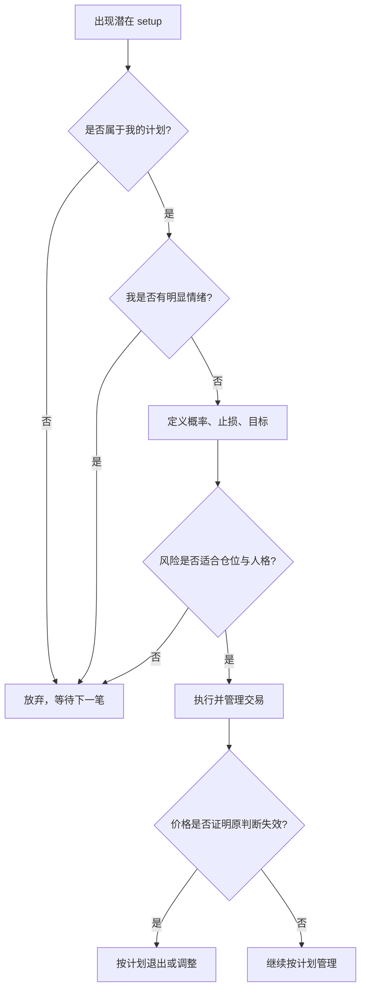

# P04 成功交易者的人格特质

## 一句话摘要

成功交易者最重要的特质不是预测准确，而是纪律、耐心、接受不确定性，并能在进场后正确管理交易。

## 材料类型与适用边界

- 类型: 交易心理 / 交易流程 / 风险管理
- 市场/品种: 示例提到 E-mini、IBM；观点面向日内交易、剥头皮和波段交易
- 周期/频率: 日内交易为主，也涉及长期职业交易方式选择
- 数据来源: 本地视频转录 `transcripts/P04_en/transcript.txt`
- 适用前提: 交易者已经有基本策略，需要提升执行、情绪控制和交易管理
- 失效条件: 把“纪律”理解成死扛亏损；把“舒服的交易方式”理解成逃避验证；忽略实际风险承受能力

## 核心概念

### 1. 成功交易者的关键特质

来源观点列出的特质:

- 客观
- 有纪律
- 有耐心
- 能接受不确定性
- 能正确管理交易

Brooks 认为最后两点尤其重要: 接受不确定性，以及管理交易。

### 2. 纪律: 不凭一时兴起试单

来源观点:

- 有纪律的交易者不会说“也许这次会有效，我试一下”。
- 如果某个形态不是自己平常交易的 setup，或者看起来不对，就放弃。
- 机构和程序化交易不根据情绪交易。想赚钱，就要尽量复制它们的客观性。
- 如果看见 setup 时感到明显情绪，不要交易。

整理推断:

- 纪律不是“永远执行每个信号”，而是只执行已经定义、能复盘的信号。
- 情绪本身可以作为过滤器: 一旦感到焦虑、害怕错过、急着证明自己，就说明决策质量下降。

### 3. 接受反向结果

来源观点:

- 市场完全可能做出与你判断相反的动作，而且可能约 40% 的时间发生。
- 每笔交易都有机构站在你这边，也有机构站在你对面。
- 你不能确信对手方机构必然错误。
- 即使是不错的交易者，也可能至少 40% 的时间亏损。

整理推断:

- 交易计划必须把“我错了”当作常态分支，而不是异常事故。
- 亏损频率本身不可怕，可怕的是亏损方式和仓位超出计划。

### 4. 耐心: 好交易不会因为时间到了就该出现

来源观点:

- 日内交易者有时要等一两个小时甚至三小时，才出现好信号。
- 好交易不会“过期必来”。
- 有些日子有 20-30 个好信号，有些日子只有 3-4 个。
- 如果市场给得少，就接受并等待。

整理推断:

- “今天还没赚到钱”不是入场理由。
- 空仓也是交易流程的一部分。

### 5. 进场时的不确定性

来源观点:

进场时至少有三类不确定:

| 不确定项 | 具体问题 |
|---|---|
| 成功概率 | 这笔交易达到目标的概率是多少? |
| 止损位置 | 用常规止损、金额止损，还是更大/更小止损? |
| 盈利目标 | 如果 bar 和波段都很大，是否应使用更大目标? |

如果因为时间不够、压力或焦虑而无法判断，就不要交易。

### 6. 找到适合人格的交易方式

来源观点:

- 交易应该能长期做下去，而不是每天痛苦、焦虑、害怕连续亏损。
- Brooks 曾经做极端剥头皮，一天约 40 笔交易，可能赚更多，但压力很大且不好玩。
- 交易方式应匹配人格。
- 波段交易者常常大部分时候都亏，但追求 2-3 倍风险的回报；如果能接受 40% 胜率，这可能是很好的入门方式。
- 有些交易者适合逆势分批建仓，但必须能承受浮亏扩大、保持仓位足够小，并坚持计划。
- 剥头皮追求高概率，但因为目标小，必须保证风险距离不大于目标距离；否则需要 80%-90% 的胜率，难度很高。

整理推断:

- 风格选择既是技术问题，也是心理和仓位问题。
- 不适合自己的方法，即便别人能赚钱，也可能让自己执行变形。

## 图表与示意

图 1: 情绪过滤与交易管理流程；概念图，不是交易建议。

## 交易规则或判断流程

学习版检查表:

| 进场前问题 | 若答案不好，动作 |
|---|---|
| 这是我已定义的 setup 吗? | 不交易 |
| 我是否只是想试一下? | 不交易 |
| 我是否焦虑、兴奋、害怕错过? | 不交易 |
| 我能接受这笔交易亏损吗? | 不能就减仓或不做 |
| 止损和目标是否匹配当前波动? | 重新定义 |
| 这类交易是否适合我的人格? | 不适合就换风格或降低频率 |

管理优先级:

1. 管理交易比发现完美 setup 更重要。
2. 大多数时候，多头和空头都可能通过不同管理方式赚钱。
3. 好交易者不只是会进场，而是能在进场后处理不确定性。

## 风险、反例与常见误读

- “接受 40% 亏损”不是允许随便亏损，而是要求每次亏损可控。
- “找到舒服的方式”不是凭感觉交易，而是选择自己能稳定执行、能复盘、风险可承受的方法。
- 分批逆势建仓可能承受很大浮亏，仓位过大时会毁掉计划。
- 剥头皮目标小，如果止损大于目标，需要极高胜率，成本和滑点会非常关键。
- “任意时刻买或卖都可能赚钱”强调的是管理能力，不是随机进场。

## 可复盘问题

- 我今天是否做了计划外交易?
- 我入场时是否有明显情绪?
- 我是否能接受连续亏损，而不改变系统?
- 我的交易方式是否让我长期处于痛苦和压力中?
- 我的仓位是否允许市场反向运行一段时间，而不迫使我恐慌退出?
- 我是否把注意力放在完美 setup，却忽略了交易管理?

## 待验证假设

- 我的交易记录中，不同风格的真实胜率、盈亏比和最大回撤分别是多少?
- 如果采用波段交易，2-3 倍风险回报是否足以覆盖较低胜率和成本?
- 如果采用剥头皮，止损距离是否经常大于目标距离?
- 情绪强烈时的交易结果是否显著差于平静执行的交易?
- 减少交易频率是否能改善决策质量和净收益?
