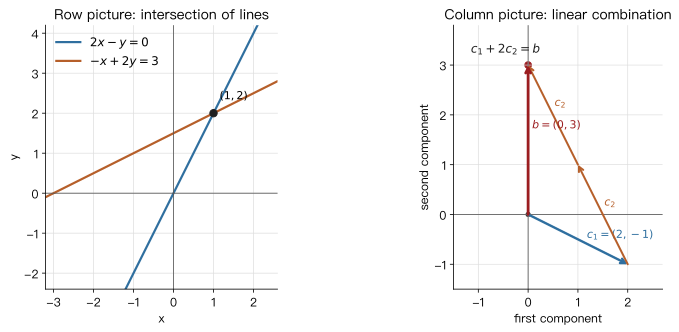
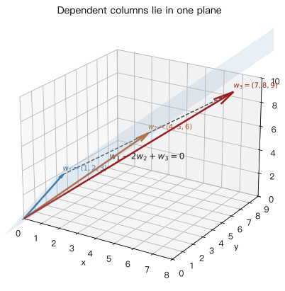

# Lecture 03: The Geometry of Linear Equations

> **Course:** MIT 18.06SC Linear Algebra, Fall 2011
> **Topic:** Lecture 03 / Session 1.1, The Geometry of Linear Equations
> **Sources:** local lecture video, lecture summary, video transcript, Session 1.1 problem set, and solutions.

---

## 0. Roadmap

This lecture starts from the basic problem of linear algebra:

$$
\text{solve } n \text{ linear equations in } n \text{ unknowns.}
$$

Gilbert Strang uses one system of equations to introduce three views:

| View | What you look at | Geometric meaning |
|---|---|---|
| **Row picture** | one equation at a time | in 2D, intersecting lines; in 3D, intersecting planes |
| **Column picture** | one matrix column at a time | combine column vectors and ask whether they produce the right-hand side $b$ |
| **Matrix form** | write the system as $Ax=b$ | compress the system into matrix-vector multiplication |

The central idea is:

$$
Ax = x_1 a_1 + x_2 a_2 + \cdots + x_n a_n,
$$

where $a_1,\dots,a_n$ are the columns of $A$. In words: **multiplying a matrix by a vector means taking a linear combination of the matrix columns**.

---

## 1. Symbols, Shapes, and the Problem

If

$$
A=
\begin{bmatrix}
| & | & & |\\
a_1 & a_2 & \cdots & a_n\\
| & | & & |
\end{bmatrix},
\qquad
x=
\begin{bmatrix}
x_1\\
x_2\\
\vdots\\
x_n
\end{bmatrix},
$$

then

$$
Ax = x_1a_1+x_2a_2+\cdots+x_na_n.
$$

Shape check:

- $A$ is an $m \times n$ matrix.
- $x$ is an $n \times 1$ vector.
- $Ax$ is an $m \times 1$ vector.
- $b$ must also be an $m \times 1$ vector for $Ax=b$ to make sense.

The lecture begins with the square case: $n$ equations and $n$ unknowns, so $A$ is $n \times n$.

---

## 2. A Two-Variable System: Row Picture

The first example is

$$
\begin{cases}
2x-y=0,\\
-x+2y=3.
\end{cases}
$$

In matrix form,

$$
\begin{bmatrix}
2 & -1\\
-1 & 2
\end{bmatrix}
\begin{bmatrix}
x\\
y
\end{bmatrix}
=
\begin{bmatrix}
0\\
3
\end{bmatrix}.
$$

The row picture reads one equation at a time:

- $2x-y=0$ is a line through the origin, because $(0,0)$ satisfies it.
- $-x+2y=3$ is another line, not through the origin.
- The solution is the point where the two lines meet.

For this example,

$$
(x,y)=(1,2).
$$

Check:

$$
2(1)-2=0,\qquad -1+2(2)=3.
$$

So in the row picture, solving the system means finding the intersection of two lines.

---

## 3. The Same System: Column Picture

Split the same matrix into columns:

$$
\begin{bmatrix}
2 & -1\\
-1 & 2
\end{bmatrix}
\begin{bmatrix}
x\\
y
\end{bmatrix}
=
x
\begin{bmatrix}
2\\
-1
\end{bmatrix}
+
y
\begin{bmatrix}
-1\\
2
\end{bmatrix}
=
\begin{bmatrix}
0\\
3
\end{bmatrix}.
$$

The column picture asks:

> How many copies of the first column and how many copies of the second column produce $b=(0,3)^T$?

Here $x=1$ and $y=2$, so

$$
1
\begin{bmatrix}
2\\
-1
\end{bmatrix}
+
2
\begin{bmatrix}
-1\\
2
\end{bmatrix}
=
\begin{bmatrix}
2\\
-1
\end{bmatrix}
+
\begin{bmatrix}
-2\\
4
\end{bmatrix}
=
\begin{bmatrix}
0\\
3
\end{bmatrix}.
$$

This is the main intuition of the lecture: **solving a system means finding the right linear combination of the columns**.

A natural next question is:

> If $x$ and $y$ can be any real numbers, which right-hand sides $b$ can be reached?

In this example the two columns are not on the same line, so their linear combinations fill the whole plane. Every two-dimensional right-hand side $b$ has a solution.

---

## 4. A Three-Variable System: Three Planes and Three Columns

The lecture then gives a three-dimensional example:

$$
\begin{cases}
2x-y+0z=0,\\
-x+2y-z=-1,\\
0x-3y+4z=4.
\end{cases}
$$

In matrix form,

$$
\begin{bmatrix}
2 & -1 & 0\\
-1 & 2 & -1\\
0 & -3 & 4
\end{bmatrix}
\begin{bmatrix}
x\\
y\\
z
\end{bmatrix}
=
\begin{bmatrix}
0\\
-1\\
4
\end{bmatrix}.
$$

### Row Picture

In three dimensions, one linear equation gives a plane.

- The first row gives one plane.
- The second row gives another plane.
- The third row gives a third plane.

In a well-behaved case, the three planes meet in one point, and that point is the solution.

Strang emphasizes a practical limitation: two intersecting lines in the plane are easy to draw, but three planes in space are already harder to visualize. In four or nine dimensions, the row picture is no longer something we can draw directly.

### Column Picture

Column-wise, the same system is

$$
x
\begin{bmatrix}
2\\
-1\\
0
\end{bmatrix}
+
y
\begin{bmatrix}
-1\\
2\\
-3
\end{bmatrix}
+
z
\begin{bmatrix}
0\\
-1\\
4
\end{bmatrix}
=
\begin{bmatrix}
0\\
-1\\
4
\end{bmatrix}.
$$

This example is chosen to be easy: the right-hand side is exactly the third column. Therefore

$$
x=0,\qquad y=0,\qquad z=1,
$$

or

$$
0a_1+0a_2+1a_3=b.
$$

If the right-hand side were the sum of the first two columns,

$$
b=
\begin{bmatrix}
2\\
-1\\
0
\end{bmatrix}
+
\begin{bmatrix}
-1\\
2\\
-3
\end{bmatrix}
=
\begin{bmatrix}
1\\
1\\
-3
\end{bmatrix},
$$

then the solution would be

$$
(x,y,z)=(1,1,0).
$$

---

## 5. What "Solvable for Every b" Means

Now generalize the question:

> For a fixed matrix $A$, does $Ax=b$ have a solution for every right-hand side $b$?

In the column picture this becomes:

> Do all linear combinations of the columns of $A$ fill the whole space?

For an $n \times n$ square matrix:

- If the columns fill all of $\mathbb{R}^n$, then every $b$ has a solution. Such a matrix is **nonsingular** or **invertible**.
- If the columns do not fill the whole space, then some $b$ cannot be reached. Such a matrix is **singular** and not invertible.

A typical failure:

> In three dimensions, if all three columns lie in the same plane, then all their linear combinations stay in that plane. They cannot produce a $b$ outside the plane.

This is why dependent columns cause non-invertibility.

---

## 6. Problem 1.1: Dependent Vectors and Non-Invertibility

The problem set gives

$$
w_1=
\begin{bmatrix}
1\\
2\\
3
\end{bmatrix},
\qquad
w_2=
\begin{bmatrix}
4\\
5\\
6
\end{bmatrix},
\qquad
w_3=
\begin{bmatrix}
7\\
8\\
9
\end{bmatrix}.
$$

We need a nonzero combination

$$
x_1w_1+x_2w_2+x_3w_3=0.
$$

The official solution gives

$$
w_1-2w_2+w_3=0.
$$

Check directly:

$$
\begin{bmatrix}
1\\2\\3
\end{bmatrix}
-2
\begin{bmatrix}
4\\5\\6
\end{bmatrix}
+
\begin{bmatrix}
7\\8\\9
\end{bmatrix}
=
\begin{bmatrix}
1-8+7\\
2-10+8\\
3-12+9
\end{bmatrix}
=
\begin{bmatrix}
0\\0\\0
\end{bmatrix}.
$$

Because a nonzero combination produces the zero vector, these three vectors are **linearly dependent**. If they are used as the columns of

$$
W=
\begin{bmatrix}
1 & 4 & 7\\
2 & 5 & 8\\
3 & 6 & 9
\end{bmatrix},
$$

then $W$ is not invertible.

Learning note: the endpoints $(1,2,3),(4,5,6),(7,8,9)$ even lie on one line. As vectors from the origin, they all lie in the plane spanned by $w_1$ and $w_2$, so they cannot fill three-dimensional space.

---

## 7. Two Algorithms for Matrix-Vector Multiplication

The lecture ends by making matrix-vector multiplication explicit. Example:

$$
\begin{bmatrix}
2 & 5\\
1 & 3
\end{bmatrix}
\begin{bmatrix}
1\\
2
\end{bmatrix}.
$$

### Column Algorithm

View the result as a linear combination of columns:

$$
1
\begin{bmatrix}
2\\
1
\end{bmatrix}
+
2
\begin{bmatrix}
5\\
3
\end{bmatrix}
=
\begin{bmatrix}
2\\
1
\end{bmatrix}
+
\begin{bmatrix}
10\\
6
\end{bmatrix}
=
\begin{bmatrix}
12\\
7
\end{bmatrix}.
$$

### Row Algorithm

You can also compute one dot product per row:

$$
\begin{bmatrix}
2 & 5\\
1 & 3
\end{bmatrix}
\begin{bmatrix}
1\\
2
\end{bmatrix}
=
\begin{bmatrix}
2\cdot 1+5\cdot 2\\
1\cdot 1+3\cdot 2
\end{bmatrix}
=
\begin{bmatrix}
12\\
7
\end{bmatrix}.
$$

Both algorithms give the same answer. Strang emphasizes the column algorithm because it connects directly to the lecture theme: $Ax$ is a linear combination of the columns of $A$.

---

## 8. Problems 1.2 and 1.3: Dimension Rules

Problem 1.2:

$$
\begin{bmatrix}
1 & 2 & 0\\
2 & 0 & 3\\
4 & 1 & 1
\end{bmatrix}
\begin{bmatrix}
3\\
-2\\
1
\end{bmatrix}
=
\begin{bmatrix}
1\cdot 3+2(-2)+0\cdot 1\\
2\cdot 3+0(-2)+3\cdot 1\\
4\cdot 3+1(-2)+1\cdot 1
\end{bmatrix}
=
\begin{bmatrix}
-1\\
9\\
11
\end{bmatrix}.
$$

Problem 1.3 asks:

> Does a $3 \times 2$ matrix $A$ times a $2 \times 3$ matrix $B$ produce a $3 \times 3$ matrix $AB$?

The answer is **true**.

The general rule is

$$
(m \times n)(n \times p) = (m \times p).
$$

The inner dimensions must match; the result keeps the row count of the left matrix and the column count of the right matrix.

---

## 9. Common Confusions

| Confusion | Correct understanding |
|---|---|
| The row picture and column picture are different problems | They are two views of the same system |
| `Ax=b` is only mechanical multiplication | `Ax` is a linear combination of the columns of $A$ |
| $n$ equations and $n$ unknowns always have a unique solution | The columns also have to be independent; equivalently, the matrix must be invertible |
| Any three vectors in $\mathbb{R}^3$ fill three-dimensional space | If they are dependent, their combinations stay in a lower-dimensional space |
| A zero right-hand side and a nonzero right-hand side have the same geometry | Equations with zero right-hand side pass through the origin; nonzero right-hand sides usually do not |

---

## 10. Takeaways

1. Row picture: one equation is a line or plane; the solution is the common intersection.
2. Column picture: the solution $x$ tells how to combine the columns of $A$ to get $b$.
3. Matrix-vector multiplication: $Ax$ is a linear combination of the columns of $A$.
4. Being solvable for every $b$ is equivalent to the columns filling the whole space.
5. Dependent columns do not add new directions, so they lead to singular and non-invertible matrices.

---

## 11. Review Questions

1. For the system
   $$
   \begin{cases}
   2x-y=0,\\
   -x+2y=3,
   \end{cases}
   $$
   why is the row-picture solution the intersection of two lines?
2. Why can
   $$
   \begin{bmatrix}
   2 & -1\\
   -1 & 2
   \end{bmatrix}
   \begin{bmatrix}
   1\\
   2
   \end{bmatrix}
   =
   \begin{bmatrix}
   0\\
   3
   \end{bmatrix}
   $$
   be read as "one first column plus two second columns"?
3. In three dimensions, if three column vectors lie in one plane, why can they not represent every $b$?
4. If $w_1-2w_2+w_3=0$, why is that enough to show that $w_1,w_2,w_3$ are linearly dependent?
5. When checking whether matrix multiplication is possible, why do we only need to compare the inner dimensions?
