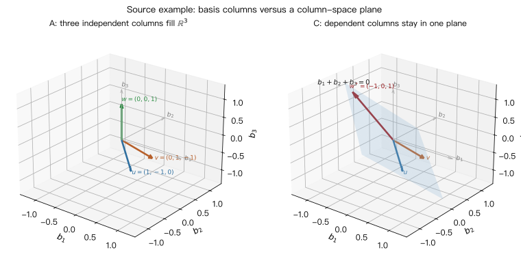

# 第 04 讲: 线性代数核心思想概览

> **课程:** MIT 18.06SC Linear Algebra, Fall 2011
> **主题:** Session 1.13, An Overview of Key Ideas
> **资料来源:** 本地视频 `[P05]05 - 复习1 ｜ 麻省理工学院18.085计算科学与工程I，2008年秋季.mp4`、`[P06]06 - 关键思想概述.mp4`、recitation transcript PDF、`MIT18_06SCF11_Ses1.13sum.pdf`

---

## 0. 本讲路线图

这是一节总览课。Strang 用两个小矩阵把线性代数的主线压缩成三步:

$$
\text{vectors} \longrightarrow \text{matrices} \longrightarrow \text{subspaces}.
$$

学完本讲, 你应该能把同一件事翻译成三种语言:

| 语言     | 问题                                  | 本讲关键词         |
| -------- | ------------------------------------- | ------------------ |
| 向量语言 | 能用哪些向量组合出目标向量?           | linear combination |
| 矩阵语言 | 方程 $Ax=b$ 是否可解? 是否唯一?       | inverse, nullspace |
| 几何语言 | 所有组合形成的是线、平面还是整个空间? | subspace, basis    |

本讲核心句:

> 线性代数真正研究的是 **线性组合**。矩阵只是把很多线性组合组织起来的工具; 子空间是“所有线性组合”形成的几何对象。

---

## 1. 从向量开始: 线性组合

向量能做的基本操作只有两类:

1. 乘以数, 也就是乘以 **标量 scalar**。
2. 相加或相减。

因此给定向量 $u,v,w$, 最自然的问题是看它们的线性组合:

$$
x_1u+x_2v+x_3w=b.
$$

本讲的具体向量在 $\mathbb{R}^3$ 中:

$$
u=
\begin{bmatrix}
1\\
-1\\
0
\end{bmatrix},
\qquad
v=
\begin{bmatrix}
0\\
1\\
-1
\end{bmatrix},
\qquad
w=
\begin{bmatrix}
0\\
0\\
1
\end{bmatrix}.
$$

几何直觉:

- $u$ 的所有倍数形成一条过原点的直线。
- $v$ 的所有倍数形成另一条过原点的直线。
- $u$ 和 $v$ 的所有线性组合形成一个过原点的平面。
- 如果再加上不在这个平面里的 $w$, 三个向量的所有组合可以填满整个 $\mathbb{R}^3$。

这就是从“向量”走向“子空间”的第一步: **取所有线性组合会生成一个空间或子空间**。

---

## 2. 把向量装进矩阵: 差分矩阵 A

把 $u,v,w$ 放进矩阵的列:

$$
A=
\begin{bmatrix}
1 & 0 & 0\\
-1 & 1 & 0\\
0 & -1 & 1
\end{bmatrix}.
$$

那么

$$
Ax=
\begin{bmatrix}
1 & 0 & 0\\
-1 & 1 & 0\\
0 & -1 & 1
\end{bmatrix}
\begin{bmatrix}
x_1\\
x_2\\
x_3
\end{bmatrix}
=
\begin{bmatrix}
x_1\\
x_2-x_1\\
x_3-x_2
\end{bmatrix}.
$$

这个矩阵叫 **difference matrix**。它把输入向量 $x$ 变成一串“一阶差分”:

$$
x=(x_1,x_2,x_3)^T
\quad\mapsto\quad
b=(x_1,\ x_2-x_1,\ x_3-x_2)^T.
$$

例如:

$$
A
\begin{bmatrix}
1\\
4\\
9
\end{bmatrix}
=
\begin{bmatrix}
1\\
3\\
5
\end{bmatrix}.
$$

这对应一个熟悉事实: 平方数 $1,4,9$ 的相邻差是奇数 $1,3,5$。

---

## 3. 矩阵乘向量的两种看法

同一个乘法 $Ax$ 可以有两种读法。

### 读法 1: 行计算

逐行点乘:

$$
\begin{aligned}
b_1 &= x_1,\\
b_2 &= x_2-x_1,\\
b_3 &= x_3-x_2.
\end{aligned}
$$

这是最常见的机械算法。

### 读法 2: 列组合

按列看:

$$
Ax=x_1
\begin{bmatrix}
1\\
-1\\
0
\end{bmatrix}
+
x_2
\begin{bmatrix}
0\\
1\\
-1
\end{bmatrix}
+
x_3
\begin{bmatrix}
0\\
0\\
1
\end{bmatrix}.
$$

这里应读成:

$$
Ax=x_1u+x_2v+x_3w.
$$

也就是说, **矩阵乘向量就是把矩阵的列按 $x$ 中的系数组合起来**。这和第 03 讲的列图像完全一致。

---

## 4. 反向问题: 给定 b, 求 x

正向问题是:

$$
x \longmapsto Ax=b.
$$

更深的问题是反向:

> 给定 $b$, 能不能找到 $x$ 使得 $Ax=b$?

对本讲的 $A$, 方程是

$$
\begin{aligned}
x_1 &= b_1,\\
x_2-x_1 &= b_2,\\
x_3-x_2 &= b_3.
\end{aligned}
$$

因为 $A$ 是下三角矩阵, 可以从上到下回代:

$$
x_1=b_1,\qquad
x_2=b_1+b_2,\qquad
x_3=b_1+b_2+b_3.
$$

写成矩阵:

$$
x=
\begin{bmatrix}
1 & 0 & 0\\
1 & 1 & 0\\
1 & 1 & 1
\end{bmatrix}
\begin{bmatrix}
b_1\\
b_2\\
b_3
\end{bmatrix}
=A^{-1}b.
$$

因此

$$
A^{-1}=
\begin{bmatrix}
1 & 0 & 0\\
1 & 1 & 0\\
1 & 1 & 1
\end{bmatrix}.
$$

这个逆矩阵是一个 **sum matrix**: 它把差分结果累加回原向量。若

$$
b=
\begin{bmatrix}
1\\
3\\
5
\end{bmatrix},
$$

则

$$
A^{-1}b=
\begin{bmatrix}
1\\
4\\
9
\end{bmatrix}.
$$

学习说明: Strang 在这里给了一个类比。差分矩阵 $A$ 像离散版“求导”, 求和矩阵 $A^{-1}$ 像离散版“积分”。微积分基本定理说积分是求导的逆; 这里矩阵语言说 $A^{-1}$ 是 $A$ 的逆。

---

## 5. 可逆矩阵: 完美的来回变换

本讲中 $A$ 是一个好矩阵:

- 对每个 $b\in\mathbb{R}^3$, 方程 $Ax=b$ 都有解。
- 解唯一。
- 如果 $Ax=0$, 那么只能有 $x=0$。
- 矩阵有逆 $A^{-1}$。
- 列向量 $u,v,w$ 形成 $\mathbb{R}^3$ 的一个 basis。

可以把 $A$ 看成一个 transform:

$$
x \xrightarrow{\ A\ } b.
$$

而 $A^{-1}$ 是反向 transform:

$$
b \xrightarrow{\ A^{-1}\ } x.
$$

这种“能去也能回来”的结构, 就是可逆矩阵的核心。

---

## 6. 第二个矩阵 C: 环形差分带来的问题

第二个例子只改动第三列。保留

$$
u=
\begin{bmatrix}
1\\
-1\\
0
\end{bmatrix},
\qquad
v=
\begin{bmatrix}
0\\
1\\
-1
\end{bmatrix},
$$

把第三列换成

$$
w^*=
\begin{bmatrix}
-1\\
0\\
1
\end{bmatrix}.
$$

得到矩阵

$$
C=
\begin{bmatrix}
1 & 0 & -1\\
-1 & 1 & 0\\
0 & -1 & 1
\end{bmatrix}.
$$

于是

$$
Cx=
\begin{bmatrix}
x_1-x_3\\
x_2-x_1\\
x_3-x_2
\end{bmatrix}.
$$

这像一个 **circular difference matrix**: 第一个分量不再只是 $x_1$, 而是 $x_1-x_3$。差分关系绕了一圈。

---

## 7. C 的麻烦 1: 非零向量也能变成零

对 $A$, 若 $Ax=0$, 只能推出 $x=0$。

对 $C$, 情况不同:

$$
C
\begin{bmatrix}
1\\
1\\
1
\end{bmatrix}
=
\begin{bmatrix}
0\\
0\\
0
\end{bmatrix}.
$$

事实上所有常数向量

$$
x=c
\begin{bmatrix}
1\\
1\\
1
\end{bmatrix}
$$

都满足 $Cx=0$。

这说明 $C$ 没有逆。原因很直接: 如果很多不同的输入都被 $C$ 送到同一个输出 $0$, 那么从输出 $0$ 不可能唯一找回输入。

这条线

$$
\operatorname{null}(C)=
\left\{
c
\begin{bmatrix}
1\\
1\\
1
\end{bmatrix}
:\ c\in\mathbb{R}
\right\}
$$

就是 $C$ 的零空间。

---

## 8. C 的麻烦 2: 不是所有 b 都可达

方程 $Cx=b$ 展开为

$$
\begin{aligned}
x_1-x_3 &= b_1,\\
x_2-x_1 &= b_2,\\
x_3-x_2 &= b_3.
\end{aligned}
$$

把三条方程左边相加:

$$
(x_1-x_3)+(x_2-x_1)+(x_3-x_2)=0.
$$

所以右边必须满足

$$
b_1+b_2+b_3=0.
$$

这不是额外假设, 而是可解的必要条件:

> $Cx=b$ 只有在 $b$ 的三个分量和为 $0$ 时才可能有解。

物理直觉: 如果 $b$ 表示作用在环形弹簧或质量系统上的力, 那么总力必须平衡, 系统才不会整体漂移。

---

## 9. C 的列空间: 一个平面

几何上, $C$ 的三列 $u,v,w^*$ 都在同一个平面里。这个平面就是

$$
b_1+b_2+b_3=0.
$$

因为

$$
1+(-1)+0=0,\qquad
0+1+(-1)=0,\qquad
(-1)+0+1=0.
$$

所以三列的任意线性组合也满足分量和为 $0$。

这张图是基于课程给出的向量重绘的学习图: 左边的 $u,v,w$ 独立, 组合填满 $\mathbb{R}^3$; 右边的 $u,v,w^*$ 相关, 组合只落在平面 $b_1+b_2+b_3=0$ 中。

于是:

$$
\operatorname{col}(C)
=
\left\{
b\in\mathbb{R}^3:\ b_1+b_2+b_3=0
\right\}.
$$

它是 $\mathbb{R}^3$ 中的二维子空间。

---

## 10. Basis: 基底的三种等价说法

本讲给出 basis 的核心直觉。对 $\mathbb{R}^n$ 中的 $n$ 个向量来说, 以下说法等价:

1. 这些向量线性独立。
2. 它们的所有线性组合覆盖整个 $\mathbb{R}^n$。
3. 把它们作为列组成的 $n\times n$ 矩阵可逆。

在本讲例子中:

- $u,v,w$ 是 $\mathbb{R}^3$ 的一组 basis。
- $u,v,w^*$ 不是 basis, 因为 $w^*$ 没有提供新的方向, 三者只张成一个平面。

一句话:

> basis 是“刚刚好够用”的一组方向: 不重复, 也不缺方向。

---

## 11. Vector space 与 subspace

**Vector space** 是一个向量集合, 它对线性组合封闭。也就是说, 如果 $a,b$ 在这个集合里, 那么

$$
\alpha a+\beta b
$$

也必须仍在这个集合里。

**Subspace** 是一个大向量空间里的小向量空间。

在 $\mathbb{R}^3$ 中, 子空间只有这些类型:

| 维度 | 子空间类型               |
| ---- | ------------------------ |
| 0    | 只有零向量的集合 $\{0\}$ |
| 1    | 过原点的直线             |
| 2    | 过原点的平面             |
| 3    | 整个 $\mathbb{R}^3$      |

注意: 子空间必须过原点。一个不过原点的平面不是 $\mathbb{R}^3$ 的子空间, 因为它不包含零向量, 也不对数乘封闭。

---

## 12. 矩阵到底“在做什么”

Strang 最后强调一个学习习惯:

> 看矩阵时, 不要只看数字表格, 要问它在做什么。

本讲两个矩阵的作用很不同:

| 矩阵 | 作用                            | 是否可逆 | 几何结果                         |
| ---- | ------------------------------- | -------- | -------------------------------- |
| $A$  | 一阶差分, 可从 $b$ 唯一恢复 $x$ | 可逆     | 列组合填满 $\mathbb{R}^3$        |
| $C$  | 环形差分, 常数向量被送到零      | 不可逆   | 列组合只形成平面 $b_1+b_2+b_3=0$ |

这就是线性代数的一个大主题: 从矩阵的列、零空间、列空间、可逆性中读出它的行为。

---

## 13. 矩形矩阵与 $A^\top A$

课程最后预告: 矩阵不一定是方阵。比如可以有 $7$ 个方程、$3$ 个未知数, 即 $A$ 是 $7\times 3$。

矩形矩阵通常不能逆, 因为输入空间和输出空间维度不同。但在线性代数和工程应用中, 常常会出现

$$
A^\top A.
$$

如果 $A$ 是 $7\times 3$, 那么

$$
A^\top A
\quad\text{是}\quad
3\times 3.
$$

它总是方阵, 并且总是对称矩阵。后续课程会反复遇到它, 尤其在网络、最小二乘、投影、工程系统中。

---

## 14. P06 关键思想练习: 由解集反推矩阵列

P06 短视频把本讲的几个关键词放进一个反向题里。题目给出的不是矩阵 $A$, 而是方程

$$
Ax=b
$$

的全体解:

$$
x=
\begin{bmatrix}
0\\
1\\
1
\end{bmatrix}
+
c
\begin{bmatrix}
0\\
2\\
1
\end{bmatrix},
\qquad
b=
\begin{bmatrix}
1\\
4\\
1\\
1
\end{bmatrix}.
$$

问题是: 能从这些信息推出 $A$ 的列向量什么性质?

先看维度。因为 $x\in\mathbb{R}^3$, 所以 $A$ 有 $3$ 列; 因为 $b\in\mathbb{R}^4$, 所以每一列都在 $\mathbb{R}^4$ 中。因此

$$
A=
\begin{bmatrix}
c_1 & c_2 & c_3
\end{bmatrix},
\qquad
c_1,c_2,c_3\in\mathbb{R}^4.
$$

把解拆成 particular solution 与 special solution:

$$
x_p=
\begin{bmatrix}
0\\
1\\
1
\end{bmatrix},
\qquad
x_s=
\begin{bmatrix}
0\\
2\\
1
\end{bmatrix}.
$$

因为每个 $x_p+c x_s$ 都解 $Ax=b$, 取 $c=0$ 得

$$
Ax_p=b.
$$

取 $c=1$ 得

$$
A(x_p+x_s)=b.
$$

两式相减:

$$
Ax_s=0.
$$

这一步就是本讲主题的浓缩: 解集中的“可自由移动方向”一定来自零空间。

现在用列组合读 $Ax$。由 $Ax_p=b$,

$$
\begin{bmatrix}
c_1 & c_2 & c_3
\end{bmatrix}
\begin{bmatrix}
0\\
1\\
1
\end{bmatrix}
=
c_2+c_3=b.
$$

由 $Ax_s=0$,

$$
\begin{bmatrix}
c_1 & c_2 & c_3
\end{bmatrix}
\begin{bmatrix}
0\\
2\\
1
\end{bmatrix}
=
2c_2+c_3=0.
$$

于是

$$
c_3=-2c_2,
\qquad
c_2+c_3=b.
$$

代回去:

$$
c_2=-b=
\begin{bmatrix}
-1\\
-4\\
-1\\
-1
\end{bmatrix},
\qquad
c_3=2b=
\begin{bmatrix}
2\\
8\\
2\\
2
\end{bmatrix}.
$$

所以第二列和第三列可以被完全确定。第一列不能被具体确定, 但有一个重要限制。

全体解只含一个自由参数 $c$, 说明

$$
\dim N(A)=1.
$$

因为 $A$ 有 $3$ 列, 秩-零度定理给出

$$
\operatorname{rank}(A)+\dim N(A)=3,
\qquad
\operatorname{rank}(A)=2.
$$

但 $c_2=-b$ 与 $c_3=2b$ 在同一条线上, 它们只贡献一个列方向。因此 $c_1$ 必须提供第二个独立方向:

$$
c_1\notin \operatorname{span}\{b\}.
$$

除此之外, 不能再确定 $c_1$。换句话说, 这个题的完整答案是:

- $A$ 是 $4\times 3$ 矩阵。
- $c_2=-b$, $c_3=2b$。
- $c_1$ 不能是 $b$ 的倍数。
- $A$ 的零空间是一条线, 列空间是 $\mathbb{R}^4$ 中的二维子空间。

学习说明: 这个例题把三件事连起来了。列组合告诉我们如何从 $Ax_p=b$ 和 $Ax_s=0$ 读出列向量关系; 零空间告诉我们为什么解不是唯一的; 秩告诉我们列空间必须有几个独立方向。

---

## 15. 常见混淆

| 混淆                                         | 正确理解                                          |
| -------------------------------------------- | ------------------------------------------------- |
| 线性组合只是计算技巧                         | 它是线性代数的基本操作                            |
| $Ax=b$ 总能解                                | 只有当 $b$ 在 $A$ 的列空间中时才可解              |
| $n$ 个向量在 $\mathbb{R}^n$ 中自动构成 basis | 还必须线性独立, 或等价地必须张成整个空间          |
| $Cx=0$ 只有零解                              | 对矩阵 $C$, 所有常数向量都是零空间里的非零解      |
| 平面都是子空间                               | 只有过原点的平面才是子空间                        |
| 矩形矩阵没有用, 因为不可逆                   | 它们很重要; $A^\top A$ 常把问题带回方阵和对称矩阵 |

---

## 16. 复习问题

1. 为什么 $Ax$ 可以解释成 $A$ 的列向量的线性组合?
2. 对差分矩阵

   $$
   A=
   \begin{bmatrix}
   1 & 0 & 0\\
   -1 & 1 & 0\\
   0 & -1 & 1
   \end{bmatrix},
   $$

   为什么 $A^{-1}$ 是一个“求和矩阵”?
3. 为什么 $C(1,1,1)^T=0$ 足以说明 $C$ 不可逆?
4. 从方程

   $$
   x_1-x_3=b_1,\quad x_2-x_1=b_2,\quad x_3-x_2=b_3
   $$

   如何推出 $b_1+b_2+b_3=0$?
5. 为什么平面 $b_1+b_2+b_3=0$ 是 $\mathbb{R}^3$ 的子空间?
6. 用 basis 的三种等价说法解释为什么 $u,v,w$ 是 $\mathbb{R}^3$ 的 basis, 而 $u,v,w^*$ 不是。
7. 如果 $Ax=b$ 的全体解是 $x_p+c x_s$, 为什么一定有 $Ax_s=0$?
8. 在 P06 例题中, 为什么 $c_2$ 和 $c_3$ 已经确定, 但 $c_1$ 只能确定到“不能是 $b$ 的倍数”?
