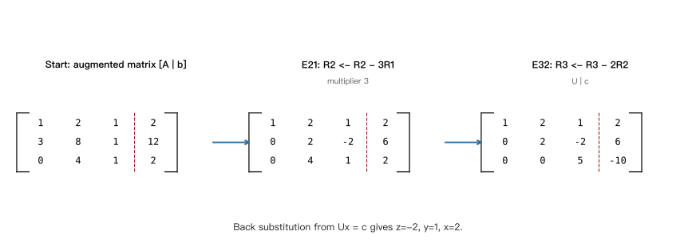
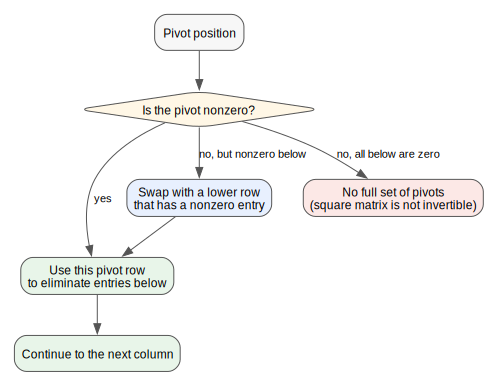
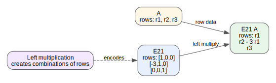

# 第 05 讲: 矩阵消元

> **课程:** MIT 18.06SC Linear Algebra, Fall 2011
> **主题:** Session 1.2, Elimination with Matrices
> **资料来源:** 本地视频 `[P07]07 - 2. 矩阵消元.mp4`、`[P08]08 - 矩阵消元.mp4`、lecture transcript PDF、lecture summary PDF、Problems PDF、Solutions PDF

---

## 0. 本讲路线图

这一讲把“解线性方程组”写成矩阵语言。核心路线是:

$$
Ax=b
\quad\longrightarrow\quad
Ux=c
\quad\longrightarrow\quad
x.
$$

其中:

- $A$ 是原始系数矩阵。
- $U$ 是经过消元得到的 upper triangular matrix。
- $b$ 是原始右端项。
- $c$ 是右端项跟着同样行操作变换后的结果。
- 最后用 back substitution 从三角系统 $Ux=c$ 求解。

本讲最重要的学习习惯:

> 消元不是一串随手算数, 而是一串可逆的行操作; 每个行操作都可以写成左乘一个矩阵。

这张图是基于课程例子重绘的学习图: 从增广矩阵 $[A\mid b]$ 出发, 用行操作变成 $[U\mid c]$, 再从最后一行向上回代。

---

## 1. 为什么不用行列式开头

Strang 一开始强调, 解方程组最常用的方法不是行列式, 而是 **elimination**。原因很实际:

- 消元是软件包解线性系统的基本方法。
- 消元可以同时告诉我们矩阵是否“好”: 是否能找到足够的 pivots。
- 消元得到三角系统后, 回代非常直接。
- 消元步骤可以写成矩阵乘法, 为后面的逆矩阵、$LU$ 分解和置换矩阵做准备。

本讲不是说行列式没有用, 而是说行列式不是求解线性系统的主要计算方法。

---

## 2. 主例子: 从 $A$ 消到 $U$

课程使用的系统是

$$
A=
\begin{bmatrix}
1 & 2 & 1\\
3 & 8 & 1\\
0 & 4 & 1
\end{bmatrix},
\qquad
b=
\begin{bmatrix}
2\\
12\\
2
\end{bmatrix}.
$$

也就是

$$
Ax=b.
$$

消元的目标是把 $A$ 变成上三角矩阵 $U$。第一列第一个 pivot 是 $1$。为了消掉第二行第一列的 $3$, 做

$$
R_2 \leftarrow R_2-3R_1.
$$

得到

$$
\begin{bmatrix}
1 & 2 & 1\\
0 & 2 & -2\\
0 & 4 & 1
\end{bmatrix}.
$$

第三行第一列本来就是 $0$, 所以不用处理。第二个 pivot 是 $2$。为了消掉第三行第二列的 $4$, 做

$$
R_3 \leftarrow R_3-2R_2.
$$

得到

$$
U=
\begin{bmatrix}
1 & 2 & 1\\
0 & 2 & -2\\
0 & 0 & 5
\end{bmatrix}.
$$

三个 pivots 是

$$
1,\quad 2,\quad 5.
$$

在没有行交换的情况下, 行列式等于 pivots 的乘积:

$$
\det(A)=1\cdot 2\cdot 5=10.
$$

学习说明: 这里提到行列式只是为了说明 pivots 含有很多矩阵信息; 本讲真正关心的是消元过程本身。

---

## 3. 增广矩阵: 右端项也要一起变

对方程组做行操作时, 右端项 $b$ 必须跟着同样变换。把 $b$ 拼在 $A$ 右边:

$$
\left[
\begin{array}{ccc|c}
1 & 2 & 1 & 2\\
3 & 8 & 1 & 12\\
0 & 4 & 1 & 2
\end{array}
\right].
$$

第一步 $R_2\leftarrow R_2-3R_1$ 使右端项第二个分量变成

$$
12-3\cdot 2=6.
$$

第二步 $R_3\leftarrow R_3-2R_2$ 使右端项第三个分量变成

$$
2-2\cdot 6=-10.
$$

所以消元后得到

$$
Ux=c,
\qquad
c=
\begin{bmatrix}
2\\
6\\
-10
\end{bmatrix}.
$$

完整三角系统是

$$
\begin{aligned}
x+2y+z &= 2,\\
2y-2z &= 6,\\
5z &= -10.
\end{aligned}
$$

---

## 4. Back Substitution: 从最后一行往上解

因为 $U$ 是上三角矩阵, 最后一行只含 $z$:

$$
5z=-10
\quad\Rightarrow\quad
z=-2.
$$

代回第二行:

$$
2y-2(-2)=6
\quad\Rightarrow\quad
2y+4=6
\quad\Rightarrow\quad
y=1.
$$

代回第一行:

$$
x+2(1)+(-2)=2
\quad\Rightarrow\quad
x=2.
$$

所以原方程组的解是

$$
x=
\begin{bmatrix}
2\\
1\\
-2
\end{bmatrix}.
$$

这说明消元和回代是一个完整算法:

1. forward elimination: 把 $A$ 变成 $U$。
2. 同步更新右端项: 把 $b$ 变成 $c$。
3. back substitution: 解 $Ux=c$。

---

## 5. Pivots 与失败方式

消元依赖 pivot。一个 pivot 不能是 $0$。

如果 pivot 位置出现 $0$, 有两种情况:

| 情况 | 处理 | 含义 |
|---|---|---|
| pivot 位置是 $0$, 下方有非零数 | 交换行 | 临时失败, 可以修复 |
| pivot 位置是 $0$, 下方没有非零数 | 无法继续得到完整 pivots | 矩阵不可逆, 没有唯一解 |

本讲例子中, 如果第二个 pivot 变成 $0$, 但第三行第二列还有非零数, 可以通过 row exchange 继续。如果最后一个 pivot 变成 $0$ 且下面没有行可换, 那就是真正失败。

学习说明: 这里的“失败”特指无法用这一组行操作得到每列一个 pivot。失败不一定意味着没有解, 但一定意味着没有唯一解的可逆方阵情形被破坏了。后面课程会更精确地区分无解与无穷多解。

这张图把 pivot 失败分成两类: 可以通过换行修复的临时失败, 和没有可用非零 pivot 的真正失败。

---

## 6. 行操作如何写成矩阵乘法

上一讲强调:

$$
A
\begin{bmatrix}
3\\
4\\
5
\end{bmatrix}
$$

是 $A$ 的列向量的线性组合。这里需要另一种对称观点:

$$
\begin{bmatrix}
1 & 2 & 7
\end{bmatrix}A
$$

是 $A$ 的行向量的线性组合:

$$
1\cdot \text{row}_1(A)
+2\cdot \text{row}_2(A)
+7\cdot \text{row}_3(A).
$$

因此, 如果要做行操作, 矩阵要乘在左边。

第一步消元

$$
R_2 \leftarrow R_2-3R_1
$$

可以写成左乘消元矩阵

$$
E_{21}=
\begin{bmatrix}
1 & 0 & 0\\
-3 & 1 & 0\\
0 & 0 & 1
\end{bmatrix}.
$$

于是

$$
E_{21}A
=
\begin{bmatrix}
1 & 2 & 1\\
0 & 2 & -2\\
0 & 4 & 1
\end{bmatrix}.
$$

这张图强调左乘的含义: $E_{21}$ 的每一行告诉你如何组合 $A$ 的行; 第二行 $[-3,1,0]$ 就是 $-3r_1+r_2$。

第二步消元

$$
R_3 \leftarrow R_3-2R_2
$$

对应

$$
E_{32}=
\begin{bmatrix}
1 & 0 & 0\\
0 & 1 & 0\\
0 & -2 & 1
\end{bmatrix}.
$$

所以完整消元过程是

$$
E_{32}(E_{21}A)=U.
$$

矩阵乘法满足结合律, 因此也可以写成

$$
(E_{32}E_{21})A=U.
$$

这里 $E_{32}E_{21}$ 是“一次性完成所有消元步骤”的矩阵。

注意: 可以移动括号, 但不能交换顺序。一般来说

$$
AB\neq BA.
$$

---

## 7. Permutation Matrix: 用矩阵交换行

当 pivot 位置是 $0$ 但下面还有非零数时, 需要交换行。交换行也可以写成左乘矩阵。

二维例子:

$$
P=
\begin{bmatrix}
0 & 1\\
1 & 0
\end{bmatrix}.
$$

左乘时,

$$
P
\begin{bmatrix}
a & b\\
c & d
\end{bmatrix}
=
\begin{bmatrix}
c & d\\
a & b
\end{bmatrix}.
$$

也就是说, 左乘 $P$ 交换行。

如果要交换列, 矩阵要乘在右边:

$$
\begin{bmatrix}
a & b\\
c & d
\end{bmatrix}
P
=
\begin{bmatrix}
b & a\\
d & c
\end{bmatrix}.
$$

一句话:

> 左乘做行操作; 右乘做列操作。

---

## 8. 消元矩阵的逆

消元步骤是可逆的。第一步

$$
E_{21}=
\begin{bmatrix}
1 & 0 & 0\\
-3 & 1 & 0\\
0 & 0 & 1
\end{bmatrix}
$$

表示“从第二行减去 $3$ 倍第一行”。要撤销它, 就把 $3$ 倍第一行加回第二行:

$$
E_{21}^{-1}=
\begin{bmatrix}
1 & 0 & 0\\
3 & 1 & 0\\
0 & 0 & 1
\end{bmatrix}.
$$

因此

$$
E_{21}^{-1}E_{21}=I.
$$

学习说明: 这就是后面逆矩阵和 $LU$ 分解的入口。消元把 $A$ 变成 $U$, 逆操作把 $U$ 还原成 $A$。

---

## 9. P08 Recitation: 四元一次系统的完整消元

P08 练习给出四个未知数 $x,y,z,u$:

$$
\begin{aligned}
x-y-z+u &= 0,\\
2x+2z &= 8,\\
-y-2z &= -8,\\
3x-3y-2z+4u &= 7.
\end{aligned}
$$

对应增广矩阵:

$$
\left[
\begin{array}{rrrr|r}
1 & -1 & -1 & 1 & 0\\
2 & 0 & 2 & 0 & 8\\
0 & -1 & -2 & 0 & -8\\
3 & -3 & -2 & 4 & 7
\end{array}
\right].
$$

第一列用第一行做 pivot:

$$
R_2\leftarrow R_2-2R_1,
\qquad
R_4\leftarrow R_4-3R_1.
$$

得到

$$
\left[
\begin{array}{rrrr|r}
1 & -1 & -1 & 1 & 0\\
0 & 2 & 4 & -2 & 8\\
0 & -1 & -2 & 0 & -8\\
0 & 0 & 1 & 1 & 7
\end{array}
\right].
$$

第二列用第二行做 pivot:

$$
R_3\leftarrow R_3+\frac{1}{2}R_2.
$$

得到

$$
\left[
\begin{array}{rrrr|r}
1 & -1 & -1 & 1 & 0\\
0 & 2 & 4 & -2 & 8\\
0 & 0 & 0 & -1 & -4\\
0 & 0 & 1 & 1 & 7
\end{array}
\right].
$$

第三列 pivot 位置出现 $0$, 但下面有 $1$, 所以交换第三行和第四行:

$$
\left[
\begin{array}{rrrr|r}
1 & -1 & -1 & 1 & 0\\
0 & 2 & 4 & -2 & 8\\
0 & 0 & 1 & 1 & 7\\
0 & 0 & 0 & -1 & -4
\end{array}
\right].
$$

现在回代:

$$
-u=-4
\quad\Rightarrow\quad
u=4.
$$

$$
z+u=7
\quad\Rightarrow\quad
z=3.
$$

$$
2y+4z-2u=8
\quad\Rightarrow\quad
2y+12-8=8
\quad\Rightarrow\quad
y=2.
$$

$$
x-y-z+u=0
\quad\Rightarrow\quad
x-2-3+4=0
\quad\Rightarrow\quad
x=1.
$$

所以解是

$$
(x,y,z,u)=(1,2,3,4).
$$

P08 的重点不是这个答案本身, 而是两件事:

- 每一步行操作必须保持方程组等价。
- 遇到 $0$ pivot 时, 先考虑能不能换行。

---

## 10. 习题 2.1: 一个二阶系统

习题给出

$$
\begin{aligned}
2x+3y &= 5,\\
6x+15y &= 12.
\end{aligned}
$$

矩阵形式:

$$
\begin{bmatrix}
2 & 3\\
6 & 15
\end{bmatrix}
\begin{bmatrix}
x\\
y
\end{bmatrix}
=
\begin{bmatrix}
5\\
12
\end{bmatrix}.
$$

第一行的 pivot 是 $2$。为了消掉第二行第一列的 $6$, 需要减去 $3$ 倍第一行:

$$
R_2\leftarrow R_2-3R_1.
$$

得到

$$
U=
\begin{bmatrix}
2 & 3\\
0 & 6
\end{bmatrix},
\qquad
c=
\begin{bmatrix}
5\\
-3
\end{bmatrix}.
$$

回代:

$$
6y=-3
\quad\Rightarrow\quad
y=-\frac{1}{2},
$$

$$
2x+3\left(-\frac{1}{2}\right)=5
\quad\Rightarrow\quad
x=\frac{13}{4}.
$$

---

## 11. 习题 2.2: Pascal 矩阵与消元矩阵

习题中的 Pascal 矩阵是

$$
\begin{bmatrix}
1 & 0 & 0 & 0\\
1 & 1 & 0 & 0\\
1 & 2 & 1 & 0\\
1 & 3 & 3 & 1
\end{bmatrix}.
$$

用消元矩阵

$$
E=
\begin{bmatrix}
1 & 0 & 0 & 0\\
-1 & 1 & 0 & 0\\
0 & -1 & 1 & 0\\
0 & 0 & -1 & 1
\end{bmatrix}
$$

左乘, 可以把它化成一个更小的 Pascal 结构:

$$
E
\begin{bmatrix}
1 & 0 & 0 & 0\\
1 & 1 & 0 & 0\\
1 & 2 & 1 & 0\\
1 & 3 & 3 & 1
\end{bmatrix}
=
\begin{bmatrix}
1 & 0 & 0 & 0\\
0 & 1 & 0 & 0\\
0 & 1 & 1 & 0\\
0 & 1 & 2 & 1
\end{bmatrix}.
$$

继续消元直到单位矩阵, 得到的总矩阵是 Pascal 矩阵的逆:

$$
M=
\begin{bmatrix}
1 & 0 & 0 & 0\\
-1 & 1 & 0 & 0\\
1 & -2 & 1 & 0\\
-1 & 3 & -3 & 1
\end{bmatrix}.
$$

这道题的意义是: 多个 elementary matrices 相乘, 就是把多步消元合成一个矩阵。若最后把原矩阵消成 $I$, 那个合成矩阵就是原矩阵的逆。

---

## 12. 常见混淆

| 混淆 | 正确理解 |
|---|---|
| 消元只是代数技巧 | 消元是一组行操作, 可以写成矩阵左乘 |
| 只变 $A$, 不变 $b$ | 解 $Ax=b$ 时右端项必须做同样行操作 |
| pivot 可以是 $0$ | pivot 不能是 $0$; 遇到 $0$ 要尝试换行 |
| 换行改变了解 | 换行只是交换方程顺序, 不改变解集 |
| $AB=BA$ | 矩阵乘法通常不可交换 |
| 左乘和右乘没有区别 | 左乘做行操作, 右乘做列操作 |
| $E_{21}^{-1}$ 很神秘 | 它只是把刚才减掉的行倍数加回去 |

---

## 13. 复习问题

1. 为什么消元要把 $A$ 和 $b$ 一起放进增广矩阵?
2. 在主例子中, 为什么第一个 multiplier 是 $3$, 第二个 multiplier 是 $2$?
3. 为什么 $U$ 是上三角矩阵后, 回代从最后一行开始?
4. 写出 $R_2\leftarrow R_2-3R_1$ 对应的消元矩阵 $E_{21}$。
5. 为什么 $E_{32}(E_{21}A)$ 可以改写成 $(E_{32}E_{21})A$?
6. 为什么上题不能改写成 $(E_{21}E_{32})A$?
7. 如果 pivot 位置是 $0$, 什么时候可以通过行交换继续?
8. 在 P08 例题中, 为什么第三列出现 $0$ pivot 后要交换第三、第四行?
