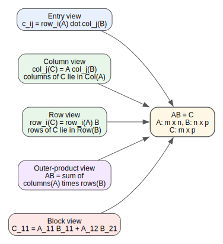
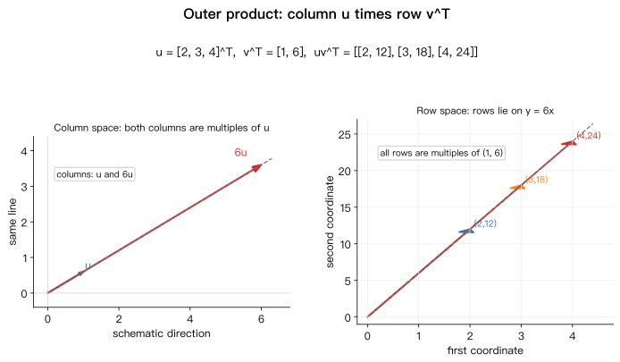
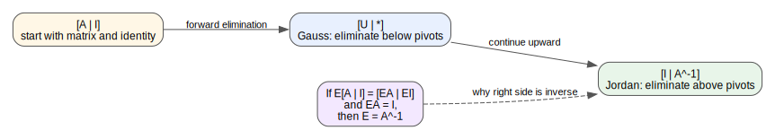

# 第 06 讲: 乘法和逆矩阵

> **课程:** MIT 18.06SC Linear Algebra, Fall 2011
> **主题:** Session 1.3, Multiplication and Inverse Matrices
> **资料来源:** 本地视频 `[P09]09 - 3. 乘法和逆矩阵.mp4`、`[P10]10 - 逆矩阵.mp4`、lecture transcript PDF、lecture summary PDF、recitation transcript PDF、Problems PDF、Solutions PDF

---

## 0. 本讲路线图

这一讲做两件事:

1. 把矩阵乘法 $AB=C$ 从多个角度看清楚。
2. 说明什么是逆矩阵, 以及如何用 Gauss-Jordan elimination 求 $A^{-1}$。

矩阵乘法不是一个单一公式, 而是同一个运算的几种等价读法:

| 视角 | 读法 | 记忆重点 |
|---|---|---|
| entry | $c_{ij}$ 是 $A$ 的第 $i$ 行与 $B$ 的第 $j$ 列点乘 | 算单个元素 |
| columns | $C$ 的每一列是 $A$ 的列向量线性组合 | 看 column space |
| rows | $C$ 的每一行是 $B$ 的行向量线性组合 | 看 row space |
| columns times rows | $AB$ 是若干 rank-one matrices 的和 | 看矩阵分解 |
| blocks | 把大矩阵当成小矩阵块相乘 | 看结构和分块计算 |

这张图把同一个乘积 $AB=C$ 的五种读法放在一起; 后面每一节都在展开其中一个读法。

逆矩阵的核心句:

> 对方阵 $A$, 若存在 $A^{-1}$, 则 $A^{-1}A=I=AA^{-1}$。求 $A^{-1}$ 等价于同时求解 $Ax=e_1,\dots,Ax=e_n$。

---

## 1. 矩阵乘法的尺寸规则

若

$$
A\in\mathbb{R}^{m\times n},
\qquad
B\in\mathbb{R}^{n\times p},
$$

则乘积 $AB$ 有意义, 且

$$
C=AB\in\mathbb{R}^{m\times p}.
$$

中间维度必须匹配:

$$
(m\times n)(n\times p)=m\times p.
$$

也就是说, $A$ 的列数必须等于 $B$ 的行数。结果保留 $A$ 的行数和 $B$ 的列数。

---

## 2. 第一种读法: 行乘列得到单个 entry

标准公式是:

$$
c_{ij}
=
\sum_{k=1}^{n}a_{ik}b_{kj}.
$$

这表示 $C$ 的第 $i$ 行第 $j$ 列元素来自:

$$
\text{row}_i(A)\cdot \text{col}_j(B).
$$

例如 $c_{34}$ 来自 $A$ 的第 $3$ 行与 $B$ 的第 $4$ 列:

$$
c_{34}
=
a_{31}b_{14}+a_{32}b_{24}+\cdots+a_{3n}b_{n4}.
$$

这一读法最适合手算某个具体元素, 但不是理解矩阵乘法结构的唯一方式。

---

## 3. 第二种读法: 一列一列地乘

把 $B$ 看成列向量并排:

$$
B=
\begin{bmatrix}
b_1 & b_2 & \cdots & b_p
\end{bmatrix}.
$$

那么

$$
AB=
\begin{bmatrix}
Ab_1 & Ab_2 & \cdots & Ab_p
\end{bmatrix}.
$$

所以 $C=AB$ 的第 $j$ 列就是 $A$ 乘以 $B$ 的第 $j$ 列。

更重要的是: 每个 $Ab_j$ 都是 $A$ 的列向量的线性组合。因此

$$
\text{columns of }C
\subseteq
\operatorname{Col}(A).
$$

学习说明: 这和前几讲的核心习惯一致。矩阵乘向量不是神秘运算, 它就是把矩阵的列按向量里的系数组合起来。

---

## 4. 第三种读法: 一行一行地乘

也可以从行看。$C=AB$ 的第 $i$ 行来自 $A$ 的第 $i$ 行乘以 $B$:

$$
C_{i,:}=A_{i,:}B.
$$

如果

$$
A_{i,:}=
\begin{bmatrix}
\alpha_1 & \alpha_2 & \cdots & \alpha_n
\end{bmatrix},
$$

那么

$$
A_{i,:}B
=
\alpha_1\text{row}_1(B)
+\alpha_2\text{row}_2(B)
+\cdots
+\alpha_n\text{row}_n(B).
$$

所以 $C$ 的每一行都是 $B$ 的行向量的线性组合:

$$
\text{rows of }C
\subseteq
\operatorname{Row}(B).
$$

一句话:

> $AB$ 的列来自 $A$ 的列空间; $AB$ 的行来自 $B$ 的行空间。

---

## 5. 第四种读法: column times row

行乘列得到一个数; 列乘行得到一个矩阵。

例如

$$
\begin{bmatrix}
2\\
3\\
4
\end{bmatrix}
\begin{bmatrix}
1 & 6
\end{bmatrix}
=
\begin{bmatrix}
2 & 12\\
3 & 18\\
4 & 24
\end{bmatrix}.
$$

这个矩阵很特殊:

- 它的两列都是 $(2,3,4)^T$ 的倍数。
- 它的三行都是 $(1,6)$ 的倍数。
- column space 是一条线, row space 也是一条线。

这类矩阵后来会叫 rank-one matrix。

一般地, 如果

$$
A=
\begin{bmatrix}
a_1 & a_2 & \cdots & a_n
\end{bmatrix},
\qquad
B=
\begin{bmatrix}
b_1^T\\
b_2^T\\
\vdots\\
b_n^T
\end{bmatrix},
$$

其中 $a_k$ 是 $A$ 的第 $k$ 列, $b_k^T$ 是 $B$ 的第 $k$ 行, 那么

$$
AB=
a_1b_1^T+a_2b_2^T+\cdots+a_nb_n^T.
$$

也就是说, 矩阵乘积可以看成若干个 column-times-row 矩阵相加。

这张图把 $uv^T$ 的几何后果画出来: 所有列都落在 $\operatorname{span}(u)$, 所有行都落在 $\operatorname{span}(v^T)$。

---

## 6. 第五种读法: block multiplication

如果把矩阵按块切开, 只要尺寸匹配, 可以像普通矩阵乘法一样按块相乘。

设

$$
A=
\begin{bmatrix}
A_1 & A_2\\
A_3 & A_4
\end{bmatrix},
\qquad
B=
\begin{bmatrix}
B_1 & B_2\\
B_3 & B_4
\end{bmatrix}.
$$

那么左上角的结果块是

$$
C_1=A_1B_1+A_2B_3.
$$

整体写成:

$$
AB=
\begin{bmatrix}
A_1B_1+A_2B_3 & A_1B_2+A_2B_4\\
A_3B_1+A_4B_3 & A_3B_2+A_4B_4
\end{bmatrix}.
$$

block multiplication 的意义是: 当大矩阵有自然结构时, 可以把它当成由小矩阵组成的对象来运算。后面做分块矩阵、消元、投影和数值计算时会反复用到。

---

## 7. 逆矩阵: 定义与基本判断

对方阵 $A$, 如果存在矩阵 $A^{-1}$ 使得

$$
A^{-1}A=I=AA^{-1},
$$

就说 $A$ 是 invertible 或 nonsingular。

不是所有方阵都有逆。例子:

$$
A=
\begin{bmatrix}
1 & 3\\
2 & 6
\end{bmatrix}.
$$

它的第二列是第一列的 $3$ 倍, 两列在同一条线上。存在非零向量

$$
x=
\begin{bmatrix}
3\\
-1
\end{bmatrix}
$$

使得

$$
Ax=
\begin{bmatrix}
1 & 3\\
2 & 6
\end{bmatrix}
\begin{bmatrix}
3\\
-1
\end{bmatrix}
=
\begin{bmatrix}
0\\
0
\end{bmatrix}.
$$

这说明 $A$ 没有逆。原因是: 如果 $A^{-1}$ 存在, 那么从 $Ax=0$ 两边左乘 $A^{-1}$ 会推出

$$
x=0,
$$

这与上面的非零 $x$ 矛盾。

重要判据:

> 方阵不可逆的一个核心信号是存在非零向量 $x$ 使得 $Ax=0$。也就是列向量有非平凡线性组合等于零。

---

## 8. 求逆等价于同时解多个方程

若 $A$ 是 $n\times n$ 方阵, 求 $A^{-1}$ 可以按列看:

$$
AA^{-1}=I.
$$

设

$$
A^{-1}=
\begin{bmatrix}
x_1 & x_2 & \cdots & x_n
\end{bmatrix},
\qquad
I=
\begin{bmatrix}
e_1 & e_2 & \cdots & e_n
\end{bmatrix}.
$$

那么

$$
Ax_j=e_j,
\qquad j=1,\dots,n.
$$

所以求 $A^{-1}$ 就是同时求解

$$
Ax=e_1,\quad Ax=e_2,\quad \dots,\quad Ax=e_n.
$$

这就是 Gauss-Jordan 的出发点: 既然这些方程有同一个系数矩阵 $A$, 就把所有右端项一起放到增广矩阵里:

$$
[A\mid I].
$$

---

## 9. Gauss-Jordan: 从 $[A\mid I]$ 到 $[I\mid A^{-1}]$

课程中的可逆例子是

$$
A=
\begin{bmatrix}
1 & 3\\
2 & 7
\end{bmatrix}.
$$

从增广矩阵开始:

$$
\left[
\begin{array}{cc|cc}
1 & 3 & 1 & 0\\
2 & 7 & 0 & 1
\end{array}
\right].
$$

先做普通 Gauss elimination:

$$
R_2\leftarrow R_2-2R_1.
$$

得到

$$
\left[
\begin{array}{cc|cc}
1 & 3 & 1 & 0\\
0 & 1 & -2 & 1
\end{array}
\right].
$$

Gauss 会在上三角这里停下, 但 Jordan 继续向上消元。用第二行消掉第一行的 $3$:

$$
R_1\leftarrow R_1-3R_2.
$$

得到

$$
\left[
\begin{array}{cc|cc}
1 & 0 & 7 & -3\\
0 & 1 & -2 & 1
\end{array}
\right].
$$

左边变成 $I$, 右边就是 $A^{-1}$:

$$
A^{-1}
=
\begin{bmatrix}
7 & -3\\
-2 & 1
\end{bmatrix}.
$$

快速验证:

$$
\begin{bmatrix}
7 & -3\\
-2 & 1
\end{bmatrix}
\begin{bmatrix}
1 & 3\\
2 & 7
\end{bmatrix}
=
\begin{bmatrix}
1 & 0\\
0 & 1
\end{bmatrix}.
$$

为什么右边会变成 $A^{-1}$? 设所有行操作合在一起等于一个矩阵 $E$。那么

$$
E[A\mid I]=[EA\mid EI].
$$

如果行操作把左边变成 $I$, 那么

$$
EA=I.
$$

所以

$$
E=A^{-1}.
$$

于是右边

$$
EI=E=A^{-1}.
$$

这就是

$$
[A\mid I]\longrightarrow [I\mid A^{-1}]
$$

的理由。

这张图说明为什么右半边会变成逆矩阵: 所有行操作合成一个矩阵 $E$, 若 $EA=I$, 则 $E=A^{-1}$。

---

## 10. P10 Recitation: 含参数矩阵的可逆条件

P10 练习的矩阵是

$$
A=
\begin{bmatrix}
a & b & b\\
a & a & b\\
a & a & a
\end{bmatrix}.
$$

先看两个显然不可逆的情况:

- 如果 $a=0$, 第三行变成零行, 矩阵不可逆。
- 如果 $a=b$, 三行相同, 矩阵不可逆。

系统求逆时, 在 Gauss-Jordan 过程中需要除以 $a$ 和 $a-b$, 因此条件是

$$
a\neq 0,
\qquad
a\neq b.
$$

在这些条件下,

$$
A^{-1}
=
\frac{1}{a-b}
\begin{bmatrix}
1 & 0 & -\frac{b}{a}\\
-1 & 1 & 0\\
0 & -1 & 1
\end{bmatrix}.
$$

学习说明: 这里的条件不是额外猜出来的, 而是在消元过程中被迫出现的。只要某一步需要除以某个量, 那个量就必须非零。

符号检查:

$$
\det(A)=a(a-b)^2.
$$

因此 $A$ 可逆也等价于

$$
a(a-b)^2\neq 0.
$$

---

## 11. 习题 3.1: 分配律

习题给出

$$
A=
\begin{bmatrix}
1 & 2\\
3 & 4
\end{bmatrix},
\qquad
B=
\begin{bmatrix}
1 & 0\\
0 & 0
\end{bmatrix},
\qquad
C=
\begin{bmatrix}
0 & 0\\
5 & 6
\end{bmatrix}.
$$

先算

$$
AB=
\begin{bmatrix}
1 & 0\\
3 & 0
\end{bmatrix},
\qquad
AC=
\begin{bmatrix}
10 & 12\\
20 & 24
\end{bmatrix}.
$$

所以

$$
AB+AC=
\begin{bmatrix}
11 & 12\\
23 & 24
\end{bmatrix}.
$$

另一方面,

$$
B+C=
\begin{bmatrix}
1 & 0\\
5 & 6
\end{bmatrix},
$$

于是

$$
A(B+C)
=
\begin{bmatrix}
1 & 2\\
3 & 4
\end{bmatrix}
\begin{bmatrix}
1 & 0\\
5 & 6
\end{bmatrix}
=
\begin{bmatrix}
11 & 12\\
23 & 24
\end{bmatrix}.
$$

因此

$$
AB+AC=A(B+C).
$$

注意: 矩阵乘法通常不交换, 但仍然满足结合律和分配律。

---

## 12. 习题 3.2: 上三角矩阵的逆

习题中的矩阵是

$$
U=
\begin{bmatrix}
1 & a & b\\
0 & 1 & c\\
0 & 0 & 1
\end{bmatrix}.
$$

用 Gauss-Jordan 在 $[U\mid I]$ 上消元:

$$
\left[
\begin{array}{ccc|ccc}
1 & a & b & 1 & 0 & 0\\
0 & 1 & c & 0 & 1 & 0\\
0 & 0 & 1 & 0 & 0 & 1
\end{array}
\right].
$$

先消第二列上方的 $a$ 和第三列中间的 $c$:

$$
R_1\leftarrow R_1-aR_2,
\qquad
R_2\leftarrow R_2-cR_3.
$$

得到

$$
\left[
\begin{array}{ccc|ccc}
1 & 0 & b-ac & 1 & -a & 0\\
0 & 1 & 0 & 0 & 1 & -c\\
0 & 0 & 1 & 0 & 0 & 1
\end{array}
\right].
$$

最后消掉第一行第三列:

$$
R_1\leftarrow R_1-(b-ac)R_3.
$$

得到

$$
\left[
\begin{array}{ccc|ccc}
1 & 0 & 0 & 1 & -a & ac-b\\
0 & 1 & 0 & 0 & 1 & -c\\
0 & 0 & 1 & 0 & 0 & 1
\end{array}
\right].
$$

所以

$$
U^{-1}
=
\begin{bmatrix}
1 & -a & ac-b\\
0 & 1 & -c\\
0 & 0 & 1
\end{bmatrix}.
$$

这个结果也说明: 对角线全为 $1$ 的上三角矩阵, 逆矩阵仍然是上三角矩阵, 对角线仍然全为 $1$。

---

## 13. 常见混淆

| 混淆 | 正确理解 |
|---|---|
| $AB$ 只能按 entry 算 | 也可以按列、按行、按 column-times-row、按 block 看 |
| $AB$ 的列来自 $B$ | $AB$ 的列是 $A$ 的列向量组合 |
| $AB$ 的行来自 $A$ | $AB$ 的行是 $B$ 的行向量组合 |
| 行乘列和列乘行差不多 | 行乘列是数; 列乘行是矩阵 |
| 方阵一定有逆 | 只有 nonsingular 方阵有逆 |
| $Ax=0$ 有非零解也没关系 | 这正是不可逆的核心信号 |
| 求逆是一个独立技巧 | 求逆就是同时解 $Ax=e_1,\dots,Ax=e_n$ |
| Gauss-Jordan 只做到上三角 | Gauss 到上三角; Jordan 继续把上方也消成 $I$ |

---

## 14. 复习问题

1. 如果 $A$ 是 $m\times n$, $B$ 是 $n\times p$, 为什么 $AB$ 是 $m\times p$?
2. 写出 $c_{ij}$ 的求和公式, 并说明每个下标是什么意思。
3. 为什么 $AB$ 的每一列都在 $\operatorname{Col}(A)$ 中?
4. 为什么 $AB$ 的每一行都是 $B$ 的行向量组合?
5. 计算 $\begin{bmatrix}2\\3\\4\end{bmatrix}\begin{bmatrix}1&6\end{bmatrix}$, 并说明为什么它的 column space 是一条线。
6. 为什么存在非零 $x$ 使 $Ax=0$ 会阻止 $A$ 有逆?
7. 为什么求 $A^{-1}$ 等价于同时求解 $Ax=e_1,\dots,Ax=e_n$?
8. 在 Gauss-Jordan 中, 为什么 $[A\mid I]\to[I\mid A^{-1}]$?
9. 对 P10 的矩阵, 为什么 $a=0$ 或 $a=b$ 时不可逆?
10. 对 $U=\begin{bmatrix}1&a&b\\0&1&c\\0&0&1\end{bmatrix}$, 验证上面给出的 $U^{-1}$。
