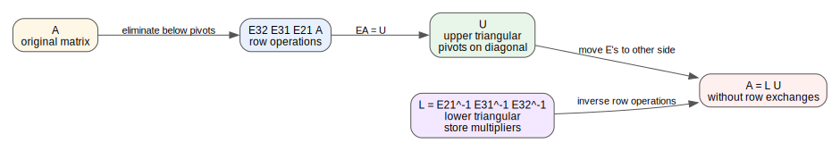
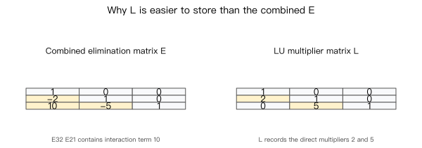
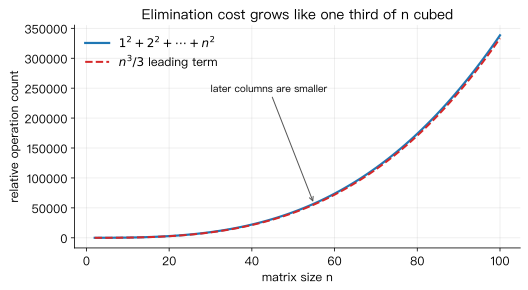

# Lecture 07: Factorization into A = LU

> **Course:** MIT 18.06SC Linear Algebra, Fall 2011
> **Topic:** Session 1.4, Factorization into A = LU
> **Sources:** local P11/P12 videos, MIT OCW lecture transcript PDF, lecture summary PDF, recitation transcript PDF, problems PDF, and solutions PDF.

---

## 0. Roadmap

The previous lectures used elimination to solve $Ax=b$ by turning $A$ into an upper triangular matrix $U$. This lecture reorganizes the same process into a factorization:

$$
A=LU.
$$

The key idea is:

> Elimination gives $EA=U$. Moving the elimination matrices to the other side gives $A=LU$.

Here:

- $U$ is upper triangular and contains the pivots on its diagonal.
- $L$ is lower triangular and records the elimination multipliers.
- If no row exchanges are needed, the multipliers used during elimination go directly into $L$.
- If row exchanges are needed, permutation matrices enter the story; the usual form becomes $PA=LU$.

This learning diagram separates the two statements: $EA=U$ describes how elimination acts on $A$; $A=LU$ stores the same computation in a reusable factorization.

---

## 1. Two Product Rules Used in the Lecture

Before deriving $A=LU$, Strang reviews two rules about products.

### Inverse of a Product

If $A$ and $B$ are invertible, then

$$
(AB)^{-1}=B^{-1}A^{-1}.
$$

The order reverses. The reason is that

$$
AB(B^{-1}A^{-1})
=A(BB^{-1})A^{-1}
=AA^{-1}
=I.
$$

### Transpose of a Product

The transpose also reverses order:

$$
(AB)^T=B^TA^T.
$$

For an invertible matrix $A$,

$$
(A^T)^{-1}=(A^{-1})^T.
$$

Learning note: both rules have the same shape. When reversing a sequence of matrix operations, the last operation must be undone first.

---

## 2. From Elimination to Factorization

Suppose elimination uses no row exchanges. If the elimination matrices are

$$
E_{21},\quad E_{31},\quad E_{32},
$$

then elimination can be written as

$$
E_{32}E_{31}E_{21}A=U.
$$

Let

$$
E=E_{32}E_{31}E_{21}.
$$

Then

$$
EA=U.
$$

To solve for $A$, multiply by $E^{-1}$ on the left:

$$
A=E^{-1}U.
$$

The matrix $E^{-1}$ is called $L$, so

$$
A=LU.
$$

Because

$$
E^{-1}
=
(E_{32}E_{31}E_{21})^{-1}
=
E_{21}^{-1}E_{31}^{-1}E_{32}^{-1},
$$

the inverse elimination steps appear in the reverse order.

---

## 3. A Two-by-Two Example

Use the matrix from the lecture:

$$
A=
\begin{bmatrix}
2 & 1\\
8 & 7
\end{bmatrix}.
$$

Eliminate the entry below the first pivot $2$. The multiplier is

$$
\ell_{21}=\frac{8}{2}=4.
$$

So

$$
R_2\leftarrow R_2-4R_1.
$$

The elimination matrix is

$$
E_{21}=
\begin{bmatrix}
1 & 0\\
-4 & 1
\end{bmatrix}.
$$

Then

$$
E_{21}A
=
\begin{bmatrix}
1 & 0\\
-4 & 1
\end{bmatrix}
\begin{bmatrix}
2 & 1\\
8 & 7
\end{bmatrix}
=
\begin{bmatrix}
2 & 1\\
0 & 3
\end{bmatrix}
=U.
$$

Move $E_{21}$ to the other side:

$$
A=E_{21}^{-1}U.
$$

Since

$$
E_{21}^{-1}
=
\begin{bmatrix}
1 & 0\\
4 & 1
\end{bmatrix},
$$

we have

$$
A=
\begin{bmatrix}
1 & 0\\
4 & 1
\end{bmatrix}
\begin{bmatrix}
2 & 1\\
0 & 3
\end{bmatrix}
=LU.
$$

Check the multiplication:

$$
\begin{bmatrix}
1 & 0\\
4 & 1
\end{bmatrix}
\begin{bmatrix}
2 & 1\\
0 & 3
\end{bmatrix}
=
\begin{bmatrix}
2 & 1\\
8 & 7
\end{bmatrix}.
$$

So $L$ stores the multiplier $4$, while $U$ stores the triangular result.

---

## 4. LDU: Separating the Pivots

In $A=LU$, the pivots sit on the diagonal of $U$. Sometimes it is useful to split them into a diagonal matrix $D$:

$$
A=LDU',
$$

where $U'$ has ones on the diagonal.

For the two-by-two example,

$$
U=
\begin{bmatrix}
2 & 1\\
0 & 3
\end{bmatrix}
=
\begin{bmatrix}
2 & 0\\
0 & 3
\end{bmatrix}
\begin{bmatrix}
1 & \frac{1}{2}\\
0 & 1
\end{bmatrix}.
$$

Therefore

$$
A=
\begin{bmatrix}
1 & 0\\
4 & 1
\end{bmatrix}
\begin{bmatrix}
2 & 0\\
0 & 3
\end{bmatrix}
\begin{bmatrix}
1 & \frac{1}{2}\\
0 & 1
\end{bmatrix}.
$$

Learning note: $LDU'$ makes the structure more balanced: $L$ and $U'$ both have ones on the diagonal, while $D$ contains the pivots.

---

## 5. Why L Stores Multipliers More Cleanly Than E

In three dimensions, the combined elimination matrix $E$ can contain interaction terms that are not original multipliers.

Suppose

$$
E_{21}=
\begin{bmatrix}
1 & 0 & 0\\
-2 & 1 & 0\\
0 & 0 & 1
\end{bmatrix},
\qquad
E_{32}=
\begin{bmatrix}
1 & 0 & 0\\
0 & 1 & 0\\
0 & -5 & 1
\end{bmatrix},
$$

and $E_{31}=I$. Then

$$
E=E_{32}E_{21}
=
\begin{bmatrix}
1 & 0 & 0\\
-2 & 1 & 0\\
10 & -5 & 1
\end{bmatrix}.
$$

The $10$ appears because the second elimination step is applied after the first row has already changed row 2.

But

$$
L=E^{-1}=E_{21}^{-1}E_{32}^{-1}
=
\begin{bmatrix}
1 & 0 & 0\\
2 & 1 & 0\\
0 & 5 & 1
\end{bmatrix}.
$$

Notice what happened:

- $E$ contains the interaction term $10$.
- $L$ records the direct multipliers $2$ and $5$ in the positions where they were used.

This is why $A=LU$ is more useful than only saying $EA=U$. The matrix $L$ stores the actual elimination history in a simple lower triangular form.

---

## 6. Computational Cost

Elimination on an $n\times n$ matrix costs roughly

$$
1^2+2^2+\cdots+n^2
\approx
\frac{1}{3}n^3
$$

multiply-subtract operations.

The intuition is:

- The first elimination stage updates almost an $n\times n$ block.
- The next stage updates an $(n-1)\times(n-1)$ block.
- Then an $(n-2)\times(n-2)$ block, and so on.

So the leading cost is cubic in $n$.

The right-hand side $b$ is cheaper. Once $A$ has been factored into $LU$, each additional right-hand side costs about $n^2$ operations to process by forward and back substitution. This is why $LU$ is useful when the same matrix $A$ appears with many different right-hand sides.

---

## 7. Row Exchanges and Permutation Matrices

The clean statement $A=LU$ assumes no row exchanges. If a pivot position contains $0$, elimination may need to exchange rows.

A row exchange is represented by a permutation matrix. For example,

$$
P_{12}=
\begin{bmatrix}
0 & 1 & 0\\
1 & 0 & 0\\
0 & 0 & 1
\end{bmatrix}
$$

swaps rows 1 and 2 when multiplying on the left.

Permutation matrices have a special inverse:

$$
P^{-1}=P^T.
$$

There are $n!$ permutation matrices of size $n\times n$, one for each ordering of the rows.

Learning note: when row exchanges are required, the robust factorization is not simply $A=LU$. It is usually written

$$
PA=LU,
$$

where $P$ records the row swaps.

---

## 8. Recitation Example: LU with Parameters

The recitation problem asks for an LU decomposition of a matrix with parameters:

$$
A=
\begin{bmatrix}
1 & 0 & 1\\
a & a & a\\
b & b & a
\end{bmatrix}.
$$

Eliminate the $(2,1)$ entry:

$$
R_2\leftarrow R_2-aR_1.
$$

This gives row 2:

$$
[a,a,a]-a[1,0,1]=[0,a,0].
$$

Eliminate the $(3,1)$ entry:

$$
R_3\leftarrow R_3-bR_1.
$$

This gives row 3:

$$
[b,b,a]-b[1,0,1]=[0,b,a-b].
$$

Now eliminate the $(3,2)$ entry. This requires the second pivot $a$ to be nonzero:

$$
R_3\leftarrow R_3-\frac{b}{a}R_2.
$$

Then

$$
U=
\begin{bmatrix}
1 & 0 & 1\\
0 & a & 0\\
0 & 0 & a-b
\end{bmatrix}.
$$

The multipliers are

$$
\ell_{21}=a,\qquad
\ell_{31}=b,\qquad
\ell_{32}=\frac{b}{a}.
$$

Therefore

$$
L=
\begin{bmatrix}
1 & 0 & 0\\
a & 1 & 0\\
b & \frac{b}{a} & 1
\end{bmatrix}.
$$

So

$$
A=LU
=
\begin{bmatrix}
1 & 0 & 0\\
a & 1 & 0\\
b & \frac{b}{a} & 1
\end{bmatrix}
\begin{bmatrix}
1 & 0 & 1\\
0 & a & 0\\
0 & 0 & a-b
\end{bmatrix}.
$$

This decomposition exists when

$$
a\neq 0.
$$

Important: $a-b$ is allowed to be $0$. That would make the matrix singular, but it does not force a row exchange during this elimination. Singular matrices can still have an LU decomposition.

---

## 9. Problem 4.1: Build E and L

The problem set asks for $E$, $E^{-1}=L$, and $A=LU$ for

$$
A=
\begin{bmatrix}
1 & 3 & 0\\
2 & 4 & 0\\
2 & 0 & 1
\end{bmatrix}.
$$

Elimination steps:

1. $R_2\leftarrow R_2-2R_1$.
2. $R_3\leftarrow R_3-2R_1$.
3. $R_3\leftarrow R_3-3R_2$ after row 2 has become $[0,-2,0]$.

The resulting upper triangular matrix is

$$
U=
\begin{bmatrix}
1 & 3 & 0\\
0 & -2 & 0\\
0 & 0 & 1
\end{bmatrix}.
$$

The combined elimination matrix is

$$
E=
\begin{bmatrix}
1 & 0 & 0\\
-2 & 1 & 0\\
4 & -3 & 1
\end{bmatrix},
$$

so

$$
L=E^{-1}
=
\begin{bmatrix}
1 & 0 & 0\\
2 & 1 & 0\\
2 & 3 & 1
\end{bmatrix}.
$$

Thus

$$
A=LU
=
\begin{bmatrix}
1 & 0 & 0\\
2 & 1 & 0\\
2 & 3 & 1
\end{bmatrix}
\begin{bmatrix}
1 & 3 & 0\\
0 & -2 & 0\\
0 & 0 & 1
\end{bmatrix}.
$$

Check:

$$
LU=
\begin{bmatrix}
1 & 3 & 0\\
2 & 4 & 0\\
2 & 0 & 1
\end{bmatrix}
=A.
$$

---

## 10. Problem 4.2: Symmetric Pattern Matrix

The problem set also asks for $L$ and $U$ for

$$
A=
\begin{bmatrix}
a & a & a & a\\
a & b & b & b\\
a & b & c & c\\
a & b & c & d
\end{bmatrix}.
$$

Elimination subtracts row 1 from rows 2, 3, and 4; then subtracts the new row 2 from rows 3 and 4; then subtracts the new row 3 from row 4.

All multipliers are $1$, so

$$
L=
\begin{bmatrix}
1 & 0 & 0 & 0\\
1 & 1 & 0 & 0\\
1 & 1 & 1 & 0\\
1 & 1 & 1 & 1
\end{bmatrix}.
$$

The upper triangular matrix is

$$
U=
\begin{bmatrix}
a & a & a & a\\
0 & b-a & b-a & b-a\\
0 & 0 & c-b & c-b\\
0 & 0 & 0 & d-c
\end{bmatrix}.
$$

There are four pivots exactly when the diagonal entries of $U$ are nonzero:

$$
a\neq 0,\qquad
b\neq a,\qquad
c\neq b,\qquad
d\neq c.
$$

---

## 11. Common Confusions

| Confusion | Correct understanding |
|---|---|
| $EA=U$ and $A=LU$ are unrelated | They are the same elimination process, written from opposite sides |
| $L$ is the same as $E$ | $L=E^{-1}$, and it stores the direct multipliers cleanly |
| The entries of $L$ are negative multipliers | For the usual $A=LU$ convention, $L$ stores the positive multipliers used in row subtraction |
| $U$ must have all nonzero pivots for an LU factorization to exist | Nonzero pivots are needed only when they are used for later elimination; a final zero pivot can still allow an LU factorization |
| A singular matrix cannot have $LU$ | Some singular matrices have $LU$; singularity only means at least one pivot is zero |
| Row exchanges are harmless for plain $A=LU$ | Row exchanges require permutation matrices; the robust form is $PA=LU$ |
| Once $LU$ is known, every new $b$ costs another full elimination | The expensive factorization is reused; each new right-hand side is much cheaper |

---

## 12. Review Questions

1. Starting from $EA=U$, why does multiplying by $E^{-1}$ give $A=LU$?
2. In the two-by-two example, why is the multiplier $4$, and where does it appear in $L$?
3. Why does the combined matrix $E$ contain a $10$ in the three-by-three example, while $L$ contains a $0$ in that position?
4. What is the difference between $LU$ and $LDU'$?
5. Why is the leading cost of elimination about $\frac{1}{3}n^3$ rather than $n^3$?
6. Why is solving for a new right-hand side cheaper after $A=LU$ is known?
7. What does a permutation matrix do when multiplied on the left?
8. In the recitation example, why is $a\neq 0$ required but $a-b\neq 0$ is not required?
9. For Problem 4.1, multiply the displayed $L$ and $U$ to check that they recover $A$.
10. For Problem 4.2, explain why the four pivot conditions are $a\neq0$, $b\neq a$, $c\neq b$, and $d\neq c$.
