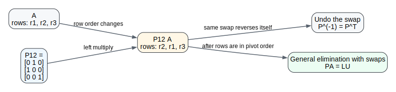
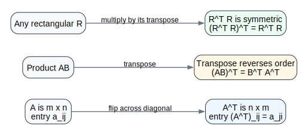
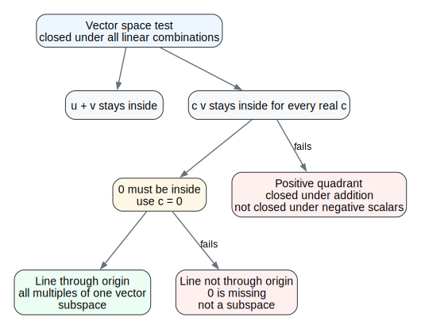
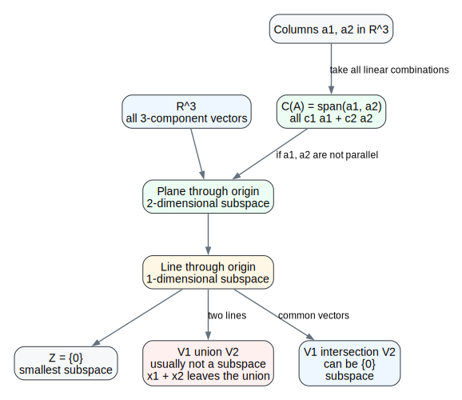

# Lecture 08: Transposes, Permutations, Vector Spaces

> **Course:** MIT 18.06SC Linear Algebra, Fall 2011
> **Topic:** Session 1.5, Transposes, Permutations, Vector Spaces
> **Sources:** local P13/P14 videos, MIT OCW lecture transcript PDF, lecture summary PDF, recitation transcript PDF, problems PDF, and solutions PDF.

---

## 0. Roadmap

This lecture finishes two tools from Chapter 2 and then starts the language that will drive the next part of the course:

1. **Permutation matrices:** row exchanges, $P^{-1}=P^T$, and the general elimination form $PA=LU$.
2. **Transposes and symmetry:** $(AB)^T=B^TA^T$, symmetric matrices, and why $R^TR$ is always symmetric.
3. **Vector spaces and subspaces:** sets of vectors that are closed under linear combinations.
4. **Column space:** the first major subspace attached to a matrix.

The big shift is this:

> Linear algebra is not only about individual vectors. It is about spaces of vectors that remain stable under addition and scalar multiplication.

---

## 1. Permutation Matrices and Row Exchanges

A permutation matrix is an identity matrix with its rows reordered. Multiplying by a permutation matrix on the left reorders the rows of another matrix.

For example,

$$
P_{12}=
\begin{bmatrix}
0&1&0\\
1&0&0\\
0&0&1
\end{bmatrix}
$$

swaps rows 1 and 2:

$$
P_{12}
\begin{bmatrix}
r_1\\
r_2\\
r_3
\end{bmatrix}
=
\begin{bmatrix}
r_2\\
r_1\\
r_3
\end{bmatrix}.
$$

There are $n!$ permutation matrices of size $n\times n$, one for each row ordering.

Every permutation matrix is invertible. To undo a row reordering, put the rows back. The inverse is especially simple:

$$
P^{-1}=P^T,
\qquad
P^TP=I.
$$

This is because every row and every column of a permutation matrix contains exactly one $1$ and all other entries are $0$.

---

## 2. Why Row Exchanges Change $A=LU$ into $PA=LU$

The clean factorization

$$
A=LU
$$

assumes elimination can proceed without swapping rows. If a pivot position contains $0$, we exchange with a lower row that has a nonzero entry in that column.

The row exchanges are collected into a permutation matrix $P$. After the rows are put into a good pivot order, elimination gives

$$
PA=LU.
$$

Here:

- $P$ records the row exchanges.
- $L$ records the elimination multipliers after the rows have been placed in pivot order.
- $U$ is the upper triangular result.

Learning note: algebra only forces row exchanges when a pivot is zero. Numerical algorithms often swap rows even when the pivot is merely very small, because small pivots can cause serious roundoff error.

---

## 3. Transpose: Rows Become Columns

The transpose of a matrix flips rows and columns. If $A$ has entry $a_{ij}$ in row $i$, column $j$, then

$$
(A^T)_{ij}=a_{ji}.
$$

For example, if

$$
A=
\begin{bmatrix}
1&2\\
4&3\\
3&1
\end{bmatrix},
$$

then

$$
A^T=
\begin{bmatrix}
1&4&3\\
2&3&1
\end{bmatrix}.
$$

The transpose of a product reverses the order:

$$
(AB)^T=B^TA^T.
$$

This has the same shape as the inverse rule

$$
(AB)^{-1}=B^{-1}A^{-1}.
$$

In both rules, the last operation in the original product becomes the first operation after reversing.

---

## 4. Symmetric Matrices and $R^TR$

A matrix is symmetric if

$$
A^T=A.
$$

Symmetry means the entries mirror across the main diagonal:

$$
\begin{bmatrix}
a&e&f\\
e&b&h\\
f&h&c
\end{bmatrix}.
$$

Symmetric matrices appear constantly in applications. A very common source is the product $R^TR$, where $R$ may be rectangular.

Why is $R^TR$ symmetric?

$$
(R^TR)^T
=R^T(R^T)^T
=R^TR.
$$

The key step is the product transpose rule, which reverses the order:

$$
(R^TR)^T=(R)^T(R^T)^T.
$$

Since $(R^T)^T=R$, the product returns to $R^TR$.

Learning note: $RR^T$ is also symmetric when the product is defined, but $R^TR$ and $RR^T$ usually have different sizes.

---

## 5. Vector Spaces: Closure Under Linear Combinations

A vector space is a collection of vectors where the usual vector operations stay inside the collection.

The two operations are:

1. Add vectors: $u+v$.
2. Multiply by scalars: $cv$.

Together these produce linear combinations:

$$
c_1v_1+c_2v_2+\cdots+c_kv_k.
$$

So the practical test is:

> A vector space must be closed under all linear combinations.

Examples:

- $\mathbb{R}^2$ is the space of all two-component real column vectors.
- $\mathbb{R}^3$ is the space of all three-component real column vectors.
- $\mathbb{R}^n$ is the space of all $n$-component real column vectors.

The vector

$$
\begin{bmatrix}3\\2\\0\end{bmatrix}
$$

is in $\mathbb{R}^3$, not $\mathbb{R}^2$, because it has three components. A zero component does not reduce the dimension of the ambient space.

---

## 6. Why the Zero Vector Is Unavoidable

Every vector space contains the zero vector.

Reason: if $v$ is in the vector space, then scalar multiplication by $0$ must also stay inside:

$$
0v=0.
$$

This explains several common failures:

- The positive quadrant in $\mathbb{R}^2$ is not a vector space. It is closed under addition, but multiplying by a negative scalar leaves the quadrant.
- A line that does not pass through the origin is not a subspace. Multiplying a vector on that line by $0$ gives the origin, which is not on the line.
- The plane with the origin removed is not a vector space. It cannot survive scalar multiplication by $0$.

The zero vector by itself,

$$
Z=\{0\},
$$

is a valid vector space. It is the smallest possible subspace.

---

## 7. Subspaces of $\mathbb{R}^2$ and $\mathbb{R}^3$

A subspace is a vector space inside another vector space.

The subspaces of $\mathbb{R}^2$ are:

1. All of $\mathbb{R}^2$.
2. Any line through the origin.
3. The zero vector alone, $Z=\{0\}$.

The subspaces of $\mathbb{R}^3$ are:

1. All of $\mathbb{R}^3$.
2. Any plane through the origin.
3. Any line through the origin.
4. The zero vector alone.

Learning note: a line through the origin inside $\mathbb{R}^2$ looks like $\mathbb{R}^1$, but it is not literally $\mathbb{R}^1$. Its vectors still have two components.

---

## 8. Column Space

The column space of a matrix $A$, written $C(A)$, is the set of all linear combinations of the columns of $A$.

If

$$
A=
\begin{bmatrix}
1&3\\
2&3\\
4&1
\end{bmatrix},
$$

then the columns are

$$
a_1=
\begin{bmatrix}
1\\2\\4
\end{bmatrix},
\qquad
a_2=
\begin{bmatrix}
3\\3\\1
\end{bmatrix}.
$$

The column space is

$$
C(A)=
\left\{
c_1
\begin{bmatrix}
1\\2\\4
\end{bmatrix}
+c_2
\begin{bmatrix}
3\\3\\1
\end{bmatrix}
:\ c_1,c_2\in\mathbb{R}
\right\}.
$$

Because the columns are vectors in $\mathbb{R}^3$, the column space is a subspace of $\mathbb{R}^3$.

In this example, the two columns are not on the same line, so all their linear combinations fill a plane through the origin in $\mathbb{R}^3$.

Important distinction:

- Two columns in $\mathbb{R}^3$ do not give $\mathbb{R}^2$.
- They give a subspace of $\mathbb{R}^3$.
- If the two columns are independent, that subspace is a plane through the origin.
- If they lie on the same line, the column space is only a line.

This is the first major bridge to the next lecture:

$$
Ax=b
$$

has a solution exactly when $b$ is in the column space of $A$.

---

## 9. Recitation: Span, Intersection, and Union

The recitation visualizes subspaces in $\mathbb{R}^3$ using two nonparallel vectors $x_1$ and $x_2$.

Let

$$
V_1=\operatorname{span}(x_1),
\qquad
V_2=\operatorname{span}(x_2).
$$

Each is a line through the origin.

If $x_1$ and $x_2$ are not parallel, then

$$
V_1\cap V_2=\{0\}.
$$

The intersection is still a subspace.

But the union

$$
V_1\cup V_2
$$

is usually not a subspace. The problem is addition: $x_1$ is in the union and $x_2$ is in the union, but $x_1+x_2$ is usually not on either line.

The smallest subspace containing both $x_1$ and $x_2$ is

$$
V_3=\operatorname{span}(x_1,x_2).
$$

If they are not parallel, $V_3$ is the plane through the origin spanned by the two vectors.

Learning note: "span" means "include all linear combinations needed to make a subspace."

---

## 10. Problem Set Notes

### Problem 5.1: Permutation Powers

A 3-cycle permutation matrix can satisfy

$$
P^3=I,\qquad P\ne I.
$$

One example is

$$
P=
\begin{bmatrix}
0&0&1\\
1&0&0\\
0&1&0
\end{bmatrix}.
$$

It cycles the rows, so after three applications the rows return to their original order.

For the 4-by-4 question, the goal is to find a permutation $\hat P$ such that

$$
\hat P^4\ne I.
$$

Use a block diagonal matrix with a $1$ block and the 3-cycle $P$:

$$
\hat P=
\begin{bmatrix}
1&0\\
0&P
\end{bmatrix}.
$$

Since $P^3=I$, also $\hat P^3=I$. Therefore

$$
\hat P^4=\hat P\ne I.
$$

### Problem 5.2: Independent Entries

For a $4\times4$ symmetric matrix, the diagonal has $4$ free entries and the entries above the diagonal determine the entries below it:

$$
4+3+2+1=10.
$$

So a symmetric $4\times4$ matrix has $10$ independently chosen entries.

For a skew-symmetric matrix,

$$
A^T=-A.
$$

The diagonal must be zero, because $a_{ii}=-a_{ii}$ implies $a_{ii}=0$. Only the entries on one side of the diagonal are free:

$$
3+2+1=6.
$$

So a skew-symmetric $4\times4$ matrix has $6$ independently chosen entries.

### Problem 5.3: Matrix Subspaces

Symmetric matrices form a subspace:

$$
A^T=A,\quad B^T=B
\quad\Longrightarrow\quad
(A+B)^T=A+B,\quad (cA)^T=cA.
$$

Skew-symmetric matrices also form a subspace:

$$
A^T=-A,\quad B^T=-B
\quad\Longrightarrow\quad
(A+B)^T=-(A+B),\quad (cA)^T=-cA.
$$

Unsymmetric matrices do not form a subspace. They are not closed under addition. For example,

$$
\begin{bmatrix}
1&1\\
0&0
\end{bmatrix}
+
\begin{bmatrix}
0&0\\
1&1
\end{bmatrix}
=
\begin{bmatrix}
1&1\\
1&1
\end{bmatrix},
$$

and the result is symmetric.

---

## 11. Common Confusions

1. **A line is not automatically a subspace.** It must pass through the origin.
2. **A plane is not automatically a subspace.** It must pass through the origin.
3. **A union of subspaces is usually not a subspace.** It often fails closure under addition.
4. **An intersection of subspaces is a subspace.** Common vectors remain closed under linear combinations.
5. **The column space lives in the space where the columns live.** If $A$ is $m\times n$, then $C(A)$ is a subspace of $\mathbb{R}^m$, not $\mathbb{R}^n$.
6. **$R^TR$ is symmetric for every rectangular $R$.** It does not require $R$ itself to be square or symmetric.

---

## 12. Review Questions

1. Why does a permutation matrix satisfy $P^{-1}=P^T$?
2. What does $P$ do in the factorization $PA=LU$?
3. Why does $(AB)^T$ reverse the order of the factors?
4. Prove that $R^TR$ is symmetric without using a numerical example.
5. Why must every vector space contain the zero vector?
6. List all subspaces of $\mathbb{R}^2$.
7. List the geometric types of subspaces of $\mathbb{R}^3$.
8. Why is the positive quadrant not a vector space?
9. Why is $V_1\cup V_2$ usually not a subspace when $V_1$ and $V_2$ are two different lines through the origin?
10. If $A$ is $3\times2$, where does its column space live?
