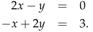
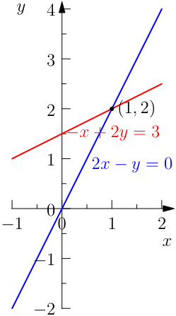
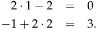

# **The geometry of linear equations**

The fundamental problem of linear algebra is to solve _n_ linear equations in _n_ unknowns; for example:

In this first lecture on linear algebra we view this problem in three ways.

The system above is two dimensional ( _n_ = 2). By adding a third variable _z_ we could expand it to three dimensions.

## **Row Picture**

Plot the points that satisfy each equation. The intersection of the plots (if they do intersect) represents the solution to the system of equations. Looking at Figure 1 we see that the solution to this system of equations is _x_ = 1, _y_ = 2.

<!-- Start of picture text -->
y 4 3 2 (1 ,  2) − x  + 2 y = 3 1 2 x − y = 0 0 − 1 0 1 2 x − 1 − 2 <!-- End of picture text -->

Figure 1: The lines 2 _x − y_ = 0 and _−x_ + 2 _y_ = 3 intersect at the point (1, 2).

We plug this solution in to the original system of equations to check our work:

The solution to a three dimensional system of equations is the common point of intersection of three planes (if there is one).

1

[|

fF | ft J il [| a ~~<u>y</u>~~ ‘ oh.

f ou I [| [| [| dt| PoE}Ld) EP 0 Pou} Edt

MIT OpenCourseWare http://ocw.mit.edu

## 18.06SC Linear Algebra

Fall 2011

For information about citing these materials or our Terms of Use, visit: http://ocw.mit.edu/terms.
