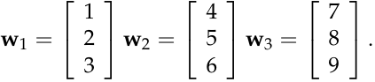
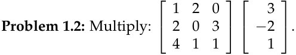

# **Exercises on the geometry of linear equations**

**Problem 1.1:** (1.3 #4. _Introduction to Linear Algebra:_ Strang) Find a combi­ nation _x_ 1 **w** 1 + _x_ 2 **w** 2 + _x_ 3 **w** 3 that gives the zero vector:

Those vectors are (independent)(dependent).

The three vectors lie in a . The matrix _W_ with those columns is _not invertible_ .

**Problem 1.3:** True or false: A 3 by 2 matrix _A_ times a 2 by 3 matrix _B_ equals a 3 by 3 matrix _AB_ . If this is false, write a similar sentence which is correct.

1

MIT OpenCourseWare http://ocw.mit.edu

# 18.06SC Linear Algebra

Fall 2011

For information about citing these materials or our Terms of Use, visit: http://ocw.mit.edu/terms.
