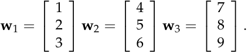
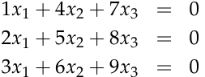
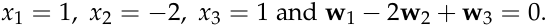
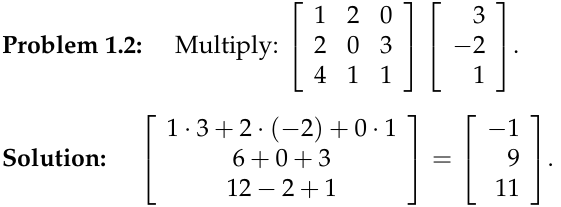

# **Exercises on the geometry of linear equations**

**Problem 1.1:** (1.3 #4. _Introduction to Linear Algebra:_ Strang) Find a com­ bination _x_ 1 **w** 1 + _x_ 2 **w** 2 + _x_ 3 **w** 3 that gives the zero vector:

Those vectors are (independent)(dependent).

The three vectors lie in a . The matrix _W_ with those columns is _not invertible_ .

**Solution:** We might observe that **w** 1 + **w** 3 _−_ 2 **w** 2 = 0, or we might si­ multaneously solve the system of equations:

Subtracting twice equation 1 from equation 2 gives us _−_ 3 _x_ 2 _−_ 6 _x_ 3 = 0. Subtracting thrice equation 1 from equation 3 gives us _−_ 6 _x_ 2 _−_ 12 _x_ 3 = 0, which is equivalent to the previous equation and so leads us to suspect that the vectors are dependent. At this point we might guess _x_ 2 = _−_ 2 and _x_ 3 = 1 which would lead us to the answer we observed above:

Those vectors are **dependent** because there is a combination of the vectors that gives the zero vector.

The three vectors lie in a **plane.**

1

**Problem 1.3:** True or false: A 3 by 2 matrix _A_ times a 2 by 3 matrix _B_ equals a 3 by 3 matrix _AB_ . If this is false, write a similar sentence which is correct.

**Solution:** The statement is true. In order to multiply two matrices, the number of columns of _A_ must equal the number of rows of _B_ . The product _AB_ will have the same number of rows as the first matrix and the same number of columns as the second:

_A_ ( _m_ by _n_ ) times _B_ ( _n_ by _p_ ) equals _AB_ ( _m_ by _p_ ).

2

MIT OpenCourseWare http://ocw.mit.edu

# 18.06SC Linear Algebra

Fall 2011

For information about citing these materials or our Terms of Use, visit: http://ocw.mit.edu/terms.
