# **An overview of key ideas**

This is an overview of linear algebra given at the start of a course on the math­ ematics of engineering.

Linear algebra progresses from vectors to matrices to subspaces.

## **Vectors**

What do you do with vectors? Take combinations.

We can multiply vectors by scalars, add, and subtract. Given vectors **u** , **v** and **w** we can form the _linear combination x_ 1 **u** + _x_ 2 **v** + _x_ 3 **w** = **b** . An example in **R**3 would be:

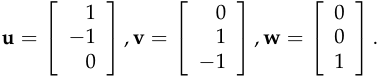

The collection of all multiples of **u** forms a line through the origin. The collec­ tion of all multiples of **v** forms another line. The collection of all combinations of **u** and **v** forms a plane. Taking _all combinations_ of some vectors creates a _subspace_ .

We could continue like this, or we can use a matrix to add in all multiples of **w** .

## **Matrices**

Create a matrix _A_ with vectors **u** , **v** and **w** in its columns:

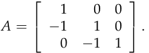

The product:

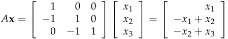

equals the sum _x_ 1 **u** + _x_ 2 **v** + _x_ 3 **w** = **b** . The product of a matrix and a vector is a combination of the columns of the matrix. (This particular matrix _A_ is a _dif­ ference matrix_ because the components of _A_ **x** are differences of the components of that vector.)

When we say _x_ 1 **u** + _x_ 2 **v** + _x_ 3 **w** = **b** we’re thinking about multiplying num­ bers by vectors; when we say _A_ **x** = **b** we’re thinking about multiplying a matrix (whose columns are **u** , **v** and **w** ) by the numbers. The calculations are the same, but our perspective has changed.

1

For any input vector **x** , the output of the operation “multiplication by _A_ ” is some vector **b** :

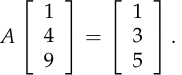

A deeper question is to start with a vector **b** and ask “for what vectors **x** does _A_ **x** = **b** ?” In our example, this means solving three equations in three un­ knowns. Solving:

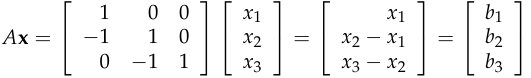

is equivalent to solving:

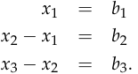

We see that _x_ 1 = _b_ 1 and so _x_ 2 must equal _b_ 1 + _b_ 2. In vector form, the solution is:

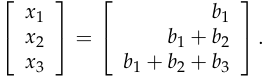

But this just says:

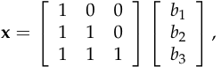

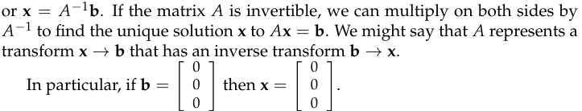

The second example has the same columns **u** and **v** and replaces column vector **w** :

Then:

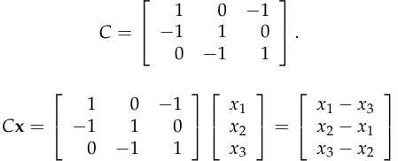

and our system of three equations in three unknowns becomes circular.

2

Where before _A_ **x** = **0** implied **x** = **0** , there are non-zero vectors **x** for which _C_ **x** = **0** . For any vector **x** with _x_ 1 = _x_ 2 = _x_ 3, _C_ **x** = **0** . This is a significant difference; we can’t multiply both sides of _C_ **x** = **0** by an inverse to find a non­ zero solution **x** .

The system of equations encoded in _C_ **x** = **b** is:

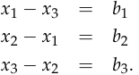

If we add these three equations together, we get:

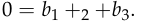

This tells us that _C_ **x** = **b** has a solution **x** only when the components of **b** sum to 0. In a physical system, this might tell us that the system is stable as long as the forces on it are balanced.

## **Subspaces**

Geometrically, the columns of _C_ lie in the same plane (they are _dependent_ ; the columns of _A_ are _independent_ ). There are many vectors in **R**3 which do not lie in that plane. Those vectors cannot be written as a linear combination of the columns of _C_ and so correspond to values of **b** for which _C_ **x** = **b** has no solu­ tion **x** . The linear combinations of the columns of _C_ form a two dimensional _subspace_ of **R**3 .

This plane of combinations of **u** , **v** and **w** can be described as “all vectors _C_ **x** ”. But we know that the vectors **b** for which _C_ **x** = **b** satisfy the condition _b_ 1 + _b_ 2 + _b_ 3 = 0. So the plane of all combinations of **u** and **v** consists of all vectors whose components sum to 0.

If we take all combinations of:

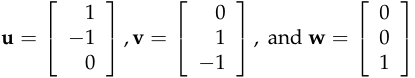

we get the entire space **R**3 ; the equation _A_ **x** = **b** has a solution for every **b** in **R**3 . We say that **u** , **v** and **w** form a _basis_ for **R**3 .

A _basis_ for **R**_n_ is a collection of _n_ independent vectors in **R**_n_ . Equivalently, a basis is a collection of _n_ vectors whose combinations cover the whole space. Or, a collection of vectors forms a basis whenever a matrix which has those vectors as its columns is invertible.

A _vector space_ is a collection of vectors that is closed under linear combina­ tions. A _subspace_ is a vector space inside another vector space; a plane through the origin in **R**3 is an example of a subspace. A subspace could be equal to the space it’s contained in; the smallest subspace contains only the zero vector. The subspaces of **R**3 are:

3

- the origin,

- a line through the origin,

- a plane through the origin,

- all of **R**3 .

## **Conclusion**

When you look at a matrix, try to see “what is it doing?”

Matrices can be rectangular; we can have seven equations in three un­ knowns. Rectangular matrices are not invertible, but the symmetric, square matrix _A__T_ _A_ that often appears when studying rectangular matrices may be invertible.

4

MIT OpenCourseWare http://ocw.mit.edu

## 18.06SC Linear Algebra

Fall 2011

For information about citing these materials or our Terms of Use, visit: http://ocw.mit.edu/terms.
