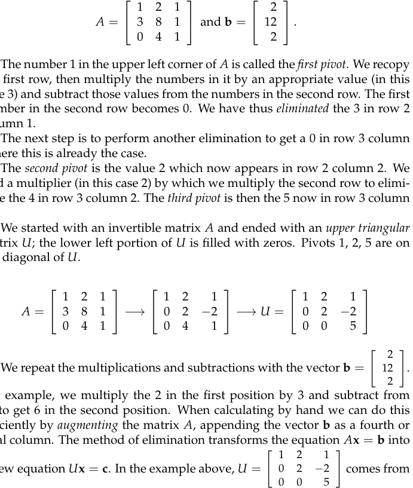
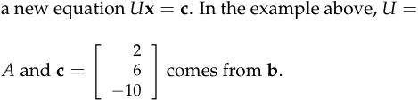
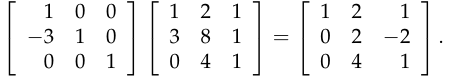
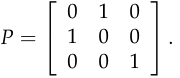
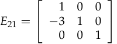
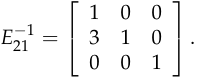

# **Elimination with matrices**

## **Method of Elimination**

_Elimination_ is the technique most commonly used by computer software to solve systems of linear equations. It finds a solution **x** to _A_ **x** = **b** whenever the matrix _A_ is invertible. In the example used in class,

The number 1 in the upper left corner of _A_ is called the _first pivot_ . We recopy the first row, then multiply the numbers in it by an appropriate value (in this case 3) and subtract those values from the numbers in the second row. The first number in the second row becomes 0. We have thus _eliminated_ the 3 in row 2 column 1.

The next step is to perform another elimination to get a 0 in row 3 column 1; here this is already the case.

The _second pivot_ is the value 2 which now appears in row 2 column 2. We find a multiplier (in this case 2) by which we multiply the second row to elimi­ nate the 4 in row 3 column 2. The _third pivot_ is then the 5 now in row 3 column 3.

We started with an invertible matrix _A_ and ended with an _upper triangular_ matrix _U_ ; the lower left portion of _U_ is filled with zeros. Pivots 1, 2, 5 are on the diagonal of _U_ .

For example, we multiply the 2 in the first position by 3 and subtract from 12 to get 6 in the second position. When calculating by hand we can do this efficiently by _augmenting_ the matrix _A_ , appending the vector **b** as a fourth or final column. The method of elimination transforms the equation _A_ **x** = **b** into

The equation _U_ **x** = _c_ is easy to solve by _back substitution_ ; in our example, _z_ = _−_ 2, _y_ = 1 and _x_ = 2. This is also a solution to the original system _A_ **x** = **b** .

1

The _determinant_ of _U_ is the product of the pivots. We will see this again. Pivots may not be 0. If there is a zero in the pivot position, we must ex­ change that row with one below to get a non-zero value in the pivot position.

If there is a zero in the pivot position and no non-zero value below it, then the matrix _A_ is not invertible. Elimination can not be used to find a unique solution to the system of equations – it doesn’t exist.

## **Elimination Matrices**

The product of a matrix (3x3) and a column vector (3x1) is a column vector (3x1) that is a linear combination of the columns of the matrix.

The product of a row (1x3) and a matrix (3x3) is a row (1x3) that is a linear combination of the rows of the matrix.

We can subtract 3 times row 1 of matrix _A_ from row 2 of _A_ by calculating the matrix product:

The _elimination matrix_ used to eliminate the entry in row _m_ column _n_ is denoted _Emn_ . The calculation above took us from _A_ to _E_ 21 _A_ . The three elimination steps leading to _U_ were: _E_ 32( _E_ 31( _E_ 21 _A_ )) = _U_ , where _E_ 31 = _I_ . Thus _E_ 32( _E_ 21 _A_ ) = _U_ .

Matrix multiplication is _associative_ , so we can also write ( _E_ 32 _E_ 21) _A_ = _U_ . The product _E_ 32 _E_ 21 tells us how to get from _A_ to _U_ . The _inverse_ of the matrix _E_ 32 _E_ 21 tells us how to get from _U_ to _A_ .

If we solve _U_ **x** = _EA_ **x** = _E_ **b** , then it is also true that _A_ **x** = **b** . This is why the method of elimination works: all steps can be reversed.

A _permutation matrix_ exchanges two rows of a matrix; for example,

The first and second rows of the matrix _PA_ are the second and first rows of the matrix _A_ . The matrix _P_ is constructed by exchanging rows of the identity matrix.

To exchange the columns of a matrix, multiply on the right (as in _AP_ ) by a permutation matrix.

Note that matrix multiplication is not _commutative_ : _PA_ = _AP_ .

## **Inverses**

We have a matrix:

2

which subtracts 3 times row 1 from row 2. To “undo” this operation we must add 3 times row 1 to row 2 using the inverse matrix:

In fact, _E_ 21_−_1_E_21 = _I_ .

3

MIT OpenCourseWare http://ocw.mit.edu

## 18.06SC Linear Algebra

Fall 2011

For information about citing these materials or our Terms of Use, visit: http://ocw.mit.edu/terms.

