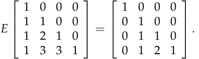

# **Exercises on elimination with matrices**

**Problem 2.1:** In the two-by-two system of linear equations below, what multiple of the first equation should be subtracted from the second equa­ tion when using the method of elimination? Convert this system of equa­ tions to matrix form, apply elimination (what are the pivots?), and use back substitution to find a solution. Try to check your work before look­ ing up the answer.

**Problem 2.2:** (2.3 #29. _Introduction to Linear Algebra:_ Strang) Find the trian­ gular matrix _E_ that reduces “ _Pascal’s matrix_ ” to a smaller Pascal:

Which matrix _M_ (multiplying several _E_ ’s) reduces Pascal all the way to _I_ ?

1

MIT OpenCourseWare http://ocw.mit.edu

# 18.06SC Linear Algebra

Fall 2011

For information about citing these materials or our Terms of Use, visit: http://ocw.mit.edu/terms.

