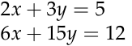
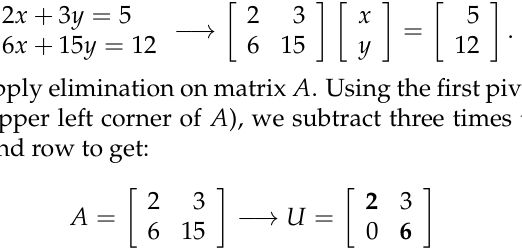
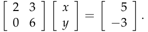
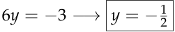
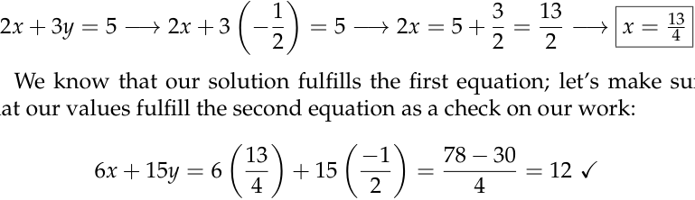
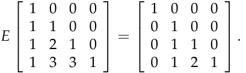
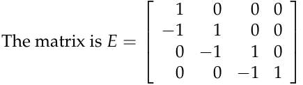
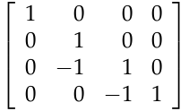
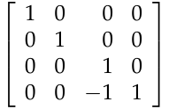
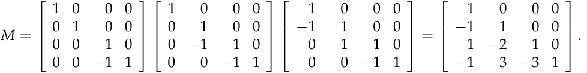

# **Exercises on elimination with matrices**

**Problem 2.1:** In the two-by-two system of linear equations below, what multiple of the first equation should be subtracted from the second equa­ tion when using the method of elimination? Convert this system of equa­ tions to matrix form, apply elimination (what are the pivots?), and use back substitution to find a solution. Try to check your work before look­ ing up the answer.

**Solution:** One subtracts **3** times the first equation from the second equa­ tion in order to eliminate the 6 _x_ .

To convert to matrix form, use the general format _A_ **x** = **b** :

We then apply elimination on matrix _A_ . Using the first pivot (the num­ ber 2 in the upper left corner of _A_ ), we subtract three times the first row from the second row to get:

where _U_ is an upper triangular matrix with pivots 2 and 6. Doing the same to the right side **b** = (5, 12) gives a new equation of the form _U_ **x** = **c** :

To solve our new equation, we use back substitution:

and

1

We know that our solution fulfills the first equation; let’s make sure that our values fulfill the second equation as a check on our work:

**Problem 2.2:** (2.3 #29. _Introduction to Linear Algebra:_ Strang) Find the triangular matrix _E_ that reduces “ _Pascal’s matrix_ ” to a smaller Pascal:

Which matrix _M_ (multiplying several _E_ ’s) reduces Pascal all the way to _I_ ?

**Solution:**

One can eliminate the second column with the matrix

and the third column with the matrix

2

Multiplying these together, we get

Since _M_ reduces the Pascal matrix to _I_ , _M_ must be the inverse matrix!

3

MIT OpenCourseWare http://ocw.mit.edu

# 18.06SC Linear Algebra

Fall 2011

For information about citing these materials or our Terms of Use, visit: http://ocw.mit.edu/terms.

