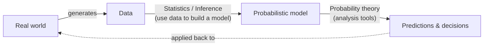

# Lecture 1 — Probability Models and Axioms

> **Course:** MIT RES.6-012 *Introduction to Probability* (Tsitsiklis & Jaillet) · based on Bertsekas & Tsitsiklis, *Introduction to Probability*, 2nd ed., Ch. 1
> **Segments covered:** L01.1 – L01.10
> **Sources:** lecture transcript + slide deck (clean & annotated) + textbook §1.1–1.2

---

## 0. Roadmap

By the end of this lecture you will know **every element of a probabilistic model**. A
**probabilistic model** is a *quantitative description of a situation, phenomenon, or
experiment whose outcome is uncertain.* Building one always takes **two steps**:

1. **Sample space** — describe the *possible outcomes*.
2. **Probability law** — describe our *beliefs about the likelihood* of those outcomes.

Outline:

- **Sample space** — what the outcomes are, and the rules a good list of them must obey.
- **Probability laws** — the **3 axioms**, and the many **properties** they imply.
- **Examples** — one **discrete**, one **continuous**.
- **Discussion** — **countable additivity** and the **mathematical subtleties** it resolves.
- **Interpretations** — what the word *probability* actually means.

> 💡 **Theme of the lecture:** the axioms are *surprisingly few* and *very intuitive*, yet
> *powerful* — almost everything else in the lecture is squeezed out of them by pure logic.

---

## 1. Sample space $\Omega$

The **sample space** $\Omega$ is the **set of all possible outcomes** of the experiment.
(Use the word *set*, not *list* — it carries the formal mathematical meaning we need.)

The elements (outcomes) must be:

| Requirement | Meaning |
|---|---|
| **Mutually exclusive** | At most one outcome can occur. If I tell you outcome $a$ happened, then $b\neq a$ did **not** happen. |
| **Collectively exhaustive** | Together they cover everything — *some* outcome always occurs. |
| **At the "right" granularity** | Include the details you care about, drop the irrelevant ones. |

> **One-line test:** at the end of the experiment you can point to **one, and exactly one,**
> element of $\Omega$ and say *"that is the outcome that occurred."*

**Granularity is a modeling choice.** For a single coin flip:

- Minimal model: $\Omega=\{H,\,T\}$.
- Over-detailed model: $\Omega=\{(H,\text{rain}),(H,\text{no rain}),(T,\text{rain}),(T,\text{no rain})\}$.

Both are *legitimate* (mutually exclusive + collectively exhaustive). The four-element one
just carries **irrelevant detail**. Prefer the simpler $\{H,T\}$ — **unless** the question
you want to answer depends on the weather (e.g. "does weather affect the coin?"), in which
case the finer space is the right one. *Choosing the level of detail is universal to all
modeling in science.*

---

## 2. Examples of sample spaces

A sample space is a *set*, so it can be **discrete & finite**, **discrete & infinite**, or
**continuous**.

### 2a. Discrete / finite — two rolls of a tetrahedral die

A tetrahedral die has 4 faces ($1,2,3,4$). We roll it **twice** — this is **one**
experiment with two stages. Record the pair $(X,Y)$ where $X$ = first roll, $Y$ = second roll.

$$\Omega=\{(x,y): x,y\in\{1,2,3,4\}\}, \qquad |\Omega| = 4\times 4 = 16.$$

Order matters: $(2,3)$ and $(3,2)$ are **distinct** outcomes.

Two equivalent pictures of the same $\Omega$:

- **Grid / 2-D table** (above): each of the 16 cells is one outcome.
- **Sequential tree** (below): useful whenever an experiment has **stages** (real or
  imagined). The **root** is the start; the **leaves** are the outcomes. Following the
  highlighted path *first roll $=2$, then second roll $=3$* lands on the leaf $(2,3)$.

Both descriptions have $16$ leaves / cells — they are the same sample space.

### 2b. Continuous — a dart on the unit square

Throw a dart that always lands inside the unit square; record $(x,y)$ with **infinite
precision** ($x,y$ real). Then

$$\Omega=\{(x,y): 0\le x\le 1,\ 0\le y\le 1\}=[0,1]^2,$$

an **uncountably infinite**, continuous sample space.

---

## 3. Probability axioms

We now do step 2: assign probabilities. **First difficulty:** in a continuous model the
probability of hitting *one exact point* (e.g. the center) is essentially $0$. So we do
**not** assign probability to individual outcomes — we assign it to **subsets**.

> **Event** = a *subset* of the sample space $\Omega$. **Probability is assigned to events.**
> After the experiment, if the outcome lies in $A$ we say *"event $A$ occurred"*, otherwise
> *"$A$ did not occur."* (Single points can have probability $0$ while sets — e.g. "upper
> half of the square" — have positive probability.)

Notation reminder: $A\cap B$ ("$A$ and $B$") = elements in **both**; $A\cup B$ ("$A$ or $B$")
= elements in **either**; $\varnothing$ = empty set; $A,B$ are **disjoint** iff
$A\cap B=\varnothing$.

By convention probabilities live in $[0,1]$: $0$ ≈ "practically cannot happen", $1$ ≈
"practically certain." A valid probability law must satisfy **three axioms**:

> ### The Probability Axioms
> 1. **(Nonnegativity)** $\;\mathbf P(A)\ge 0\;$ for every event $A$.
> 2. **(Normalization)** $\;\mathbf P(\Omega)=1.$
> 3. **(Additivity)** If $A\cap B=\varnothing$ then $\;\mathbf P(A\cup B)=\mathbf P(A)+\mathbf P(B).$
>    *(To be strengthened to **countable** additivity in §7.)*

**Intuition for additivity.** Think of probability as **1 pound of "stuff" spread over
$\Omega$**; $\mathbf P(A)$ is how much stuff sits on top of $A$. For disjoint $A,B$, the stuff
on $A\cup B$ is just (stuff on $A$) + (stuff on $B$).

> **Why no axiom "$\mathbf P(A)\le 1$"?** We don't *need* one — it (and several other natural
> facts) **follows** from the three axioms. Few axioms, many consequences.

---

## 4. Consequences of the axioms

Everything below is derived using only the three axioms (call them **A** = nonnegativity,
**B** = normalization, **C** = additivity).

| Property | Statement |
|---|---|
| Upper bound | $\mathbf P(A)\le 1$ |
| Empty set | $\mathbf P(\varnothing)=0$ |
| Complement | $\mathbf P(A)+\mathbf P(A^c)=1$ |
| Finite additivity | disjoint $A_1,\dots,A_k\Rightarrow \mathbf P\!\big(\bigcup_i A_i\big)=\sum_i \mathbf P(A_i)$ |
| Finite set | $\mathbf P(\{s_1,\dots,s_k\})=\sum_{i}\mathbf P(s_i)$ |
| Monotonicity | $A\subset B\Rightarrow \mathbf P(A)\le \mathbf P(B)$ |
| Inclusion–exclusion | $\mathbf P(A\cup B)=\mathbf P(A)+\mathbf P(B)-\mathbf P(A\cap B)$ |
| **Union bound** | $\mathbf P(A\cup B)\le \mathbf P(A)+\mathbf P(B)$ |
| Three-set union | $\mathbf P(A\cup B\cup C)=\mathbf P(A)+\mathbf P(A^c\cap B)+\mathbf P(A^c\cap B^c\cap C)$ |

### Selected proofs (each is a one-liner from the axioms)

**Complement & upper bound.** A set and its complement are disjoint and cover $\Omega$:
$$1\stackrel{\text{B}}{=}\mathbf P(\Omega)=\mathbf P(A\cup A^c)\stackrel{\text{C}}{=}\mathbf P(A)+\mathbf P(A^c)
\;\Rightarrow\; \mathbf P(A)=1-\underbrace{\mathbf P(A^c)}_{\ge 0\ \text{by A}}\le 1.$$

**Empty set.** Put $A=\Omega$ above; since $\Omega^c=\varnothing$ and $\mathbf P(\Omega)=1$:
$\;\mathbf P(\varnothing)=1-\mathbf P(\Omega)=0.$

**Additivity for 3 disjoint sets** (then induct for $k$). Group two at a time:
$$\mathbf P(A\cup B\cup C)=\mathbf P\big((A\cup B)\cup C\big)\stackrel{\text{C}}{=}\mathbf P(A\cup B)+\mathbf P(C)\stackrel{\text{C}}{=}\mathbf P(A)+\mathbf P(B)+\mathbf P(C).$$

**Probability of a finite set.** Write $\{s_1,\dots,s_k\}=\{s_1\}\cup\cdots\cup\{s_k\}$
(disjoint singletons) and apply finite additivity:
$$\mathbf P(\{s_1,\dots,s_k\})=\mathbf P(\{s_1\})+\cdots+\mathbf P(\{s_k\}).$$
*(Abuse of notation: we write $\mathbf P(s_i)$ for $\mathbf P(\{s_i\})$.)*

**Monotonicity.** If $A\subset B$, split $B=A\cup(A^c\cap B)$ (disjoint):
$$\mathbf P(B)=\mathbf P(A)+\underbrace{\mathbf P(A^c\cap B)}_{\ge 0}\ \ge\ \mathbf P(A).$$

**Inclusion–exclusion.** Split $A\cup B$ into 3 disjoint pieces with probabilities
$a=\mathbf P(A\cap B^c)$, $b=\mathbf P(A\cap B)$, $c=\mathbf P(A^c\cap B)$. Then
$\mathbf P(A\cup B)=a+b+c$, while $\mathbf P(A)+\mathbf P(B)-\mathbf P(A\cap B)=(a+b)+(b+c)-b=a+b+c.$ ✓
The **union bound** follows because $\mathbf P(A\cap B)\ge 0$.

---

## 5. A discrete example (worked)

Two rolls of the tetrahedral die, **all 16 outcomes equally likely**, so each has
probability $\tfrac1{16}$. Probabilities of events are found by **counting** (see grid in §2a):

- $\mathbf P(X=1)$ — first roll is $1$: the column of $4$ cells $\Rightarrow$
  $\dfrac{4}{16}=\dfrac14.$
- Let $Z=\min(X,Y)$.
  - $\mathbf P(Z=4)$ — needs $X=Y=4$: a single outcome $\Rightarrow \dfrac{1}{16}.$
  - $\mathbf P(Z=2)$ — one die is $2$, the other $\ge 2$: outcomes
    $(2,2),(2,3),(2,4),(3,2),(4,2)$, i.e. $5$ cells $\Rightarrow \dfrac{5}{16}.$

> ### Discrete uniform law
> If $\Omega$ has $n$ **equally likely** outcomes, then each has probability $1/n$
> (forced by normalization), and for any event $A$
> $$\boxed{\ \mathbf P(A)=\frac{\text{number of elements of }A}{n}=\frac{|A|}{n}\ }$$
> So computing probabilities reduces to **counting** — which is why a whole later lecture is
> devoted to counting.

*(General discrete law, not necessarily uniform:
$\mathbf P(\{s_1,\dots,s_n\})=\mathbf P(s_1)+\cdots+\mathbf P(s_n)$.)*

---

## 6. A continuous example (worked)

Dart on the unit square $\Omega=[0,1]^2$ with the **uniform law**: the probability of a
subset **equals its area**,
$$\mathbf P(A)=\operatorname{area}(A).$$
*(This is an arbitrary but reasonable modeling choice — nothing forces it.)*

- **Event $\{x+y\le \tfrac12\}$** is the triangle below the line $x+y=\tfrac12$, with legs
  $\tfrac12$:
  $$\mathbf P\!\left(x+y\le\tfrac12\right)=\operatorname{area}=\tfrac12\cdot\tfrac12\cdot\tfrac12=\tfrac18.$$
- **Single point $\{(0.5,0.3)\}$**: area of one point is $0$, so $\mathbf P=0$. Same for *any*
  single point — yet the whole square has probability $1$. (This tension is resolved in §7.)

> ### The 4-step recipe for any probability calculation
> 1. **Sample space** — write down $\Omega$.
> 2. **Probability law** — specify it *(has some arbitrariness; pick one that models reality)*.
> 3. **Identify the event** — translate the (often loose) word description into a subset;
>    **draw a picture.**
> 4. **Compute** $\mathbf P(\text{event})$.
>
> Being systematic with these 4 steps always yields a single correct answer. *Pictures are
> immensely useful.*

---

## 7. Countable additivity & mathematical subtleties

### A discrete but *infinite* sample space

Toss a coin repeatedly; outcome = **number of tosses until the first heads**. Any positive
integer is possible, so $\Omega=\{1,2,3,\dots\}$ is **infinite**. Suppose the law on
singletons is
$$\mathbf P(n)=\frac{1}{2^{\,n}},\qquad n=1,2,3,\dots$$

**Sanity check (do they sum to 1?):**
$$\sum_{n=1}^{\infty}\frac{1}{2^n}=\frac12\sum_{n=0}^{\infty}\frac{1}{2^n}=\frac12\cdot\frac{1}{1-\tfrac12}=1.\ \checkmark$$

**A general event, e.g. "outcome is even":**
$$\mathbf P(\text{even})=\mathbf P(\{2\}\cup\{4\}\cup\{6\}\cup\cdots)=\sum_{k=1}^{\infty}\frac{1}{2^{2k}}
=\frac14\cdot\frac{1}{1-\tfrac14}=\frac13.$$

But this used additivity on **infinitely many** disjoint sets — which axiom 3 (finite
additivity) does **not** cover. We *want* to allow it, so we **strengthen** the axiom:

> ### Axiom 3′ — Countable additivity (replaces finite additivity)
> If $A_1,A_2,A_3,\dots$ is an **infinite *sequence* of disjoint events**, then
> $$\mathbf P\!\left(\bigcup_{i=1}^{\infty}A_i\right)=\sum_{i=1}^{\infty}\mathbf P(A_i).$$
> The key word is **sequence**: the events must be arrangeable as a 1st, 2nd, 3rd, …

### Why "sequence" matters — the $1=0$ "paradox"

On the unit square (area law), write the whole square as the union of its single points:
$$\Omega=\bigcup_{\text{points }p}\{p\},\qquad \mathbf P(\{p\})=0.$$
If we could "add" these: $\mathbf P(\Omega)=\sum 0 = 0$. But normalization says
$\mathbf P(\Omega)=1$. So $1=0$?!

**Resolution:** countable additivity applies **only to a *sequence***. The points of the unit
square **cannot** be arranged in a sequence — the square is **uncountable**. The illegal step
is treating an uncountable union as if it were a countable one. No contradiction.

### Countable vs uncountable infinite sets

> - **Countable** = can be put in 1-to-1 correspondence with the positive integers
>   (arrangeable as a sequence). Examples: $\mathbb N$, the integers $\mathbb Z$, **pairs of
>   integers**, the **rationals** $\mathbb Q\cap(0,1)$.
> - **Uncountable** = not countable. Examples: the interval $[0,1]$, the real line
>   $\mathbb R$, the plane.

**The reals are uncountable — Cantor's diagonal argument (sketch).** Suppose
$\{x\in(0,1):$ decimal expansion uses only digits $3,4\}$ were countable, listed as
$x_1,x_2,x_3,\dots$. Build $x$ by choosing its $i$-th digit to **differ** from the $i$-th
digit of $x_i$ (swap $3\!\leftrightarrow\!4$). Then $x\neq x_i$ for **every** $i$, yet $x$ is
in the set — contradiction. So no such list exists.

> **Measure-theory caveat (don't worry about it in this course).** Is "area" really a valid
> probability law — does it even satisfy countable additivity? Yes, **as long as we stick to
> "nice" subsets.** Pathological non-measurable sets exist, but we never meet them here. The
> subtleties are real but can be made fully rigorous (the subject is **measure theory**).

---

## 8. Interpretations of probability

What does the number $\mathbf P(A)$ *mean*?

- **As a branch of math.** Start from axioms, derive theorems — you needn't ever ask what
  "probability" *means*.
- **Frequency interpretation.** A later theorem says: tossing a fair coin infinitely often,
  the **fraction of heads → ½**. So $\mathbf P(A)$ ≈ the long-run frequency of $A$ over many
  independent repetitions. Natural for coin tosses.
- **Belief interpretation.** "The president will be re-elected with probability $0.7$" —
  there is no "infinite repetition of the next election." Here probability encodes a **degree
  of belief**, e.g. the **bets** you'd be willing to make.
- **Objective vs subjective?** Beliefs sound subjective, but probability at minimum gives
  **consistent rules for reasoning about uncertainty.** If your model relates to the real
  world, it becomes a powerful tool for **predictions and decisions** — and how good they are
  depends on how good your model is.

**Real world ⇄ Statistics ⇄ Probability.** Statistics chooses the model from data;
probability analyzes the model to make predictions:

---

## 9. Quick-reference formula sheet

**Model** = $(\Omega,\ \mathbf P)$: sample space + probability law.

**Axioms.** (A) $\mathbf P(A)\ge0$  ·  (B) $\mathbf P(\Omega)=1$  ·  (C) disjoint sequence
$\Rightarrow \mathbf P\big(\bigcup_i A_i\big)=\sum_i \mathbf P(A_i)$.

**Derived.**
$$\mathbf P(\varnothing)=0,\quad \mathbf P(A)\le1,\quad \mathbf P(A^c)=1-\mathbf P(A),\quad A\subset B\Rightarrow\mathbf P(A)\le\mathbf P(B),$$
$$\mathbf P(A\cup B)=\mathbf P(A)+\mathbf P(B)-\mathbf P(A\cap B),\qquad \mathbf P(A\cup B)\le\mathbf P(A)+\mathbf P(B)\ \text{(union bound)}.$$

**Discrete law:** $\mathbf P(\{s_1,\dots,s_n\})=\sum_i\mathbf P(s_i)$.
**Discrete uniform:** $\mathbf P(A)=|A|/|\Omega|$.
**Continuous uniform on $[0,1]^2$:** $\mathbf P(A)=\operatorname{area}(A)$; single points have
probability $0$.

**Geometric series:** $\displaystyle\sum_{i=0}^{\infty}\alpha^i=\frac{1}{1-\alpha}\ (|\alpha|<1).$

---

## 10. Self-check questions

1. State the three axioms. Which natural property is **not** an axiom but follows from them?
2. Why must outcomes in $\Omega$ be mutually exclusive *and* collectively exhaustive?
3. For the two-roll die, find $\mathbf P(\max(X,Y)=2)$ and $\mathbf P(X+Y=5)$.
   *(Answers: $3/16$; $4/16=1/4$.)*
4. On the unit square, find $\mathbf P(\,\max(x,y)\le \tfrac12\,)$ and $\mathbf P(x\ge y)$.
   *(Answers: $1/4$; $1/2$.)*
5. Why does the "$\Omega=\bigcup\{\text{points}\}$ so $1=0$" argument fail, but the
   "$\mathbf P(\text{even})=1/3$" argument succeed?
6. Give one quantity better described by the **belief** interpretation than the **frequency**
   interpretation.

---

## Appendix — Mathematical background

*(Companion "Mathematical background" slides — the toolkit the axioms and §7 rely on.)*

### A1. Sets

A **set** is a collection of **distinct** elements: $\{a,b,c,d\}$ (finite), $\mathbb R$
(infinite), or specified by a rule $\{x\in\mathbb R: \cos x>\tfrac12\}$.

- $x\in S$ / $x\notin S$ ; **universal set** $\Omega$ ; **empty set** $\varnothing$, with
  $\Omega^c=\varnothing$.
- **Complement:** $x\in S^c \iff x\in\Omega,\ x\notin S$; and $(S^c)^c=S$.
- **Subset:** $S\subset T$ means $x\in S\Rightarrow x\in T$. ($S\subset T$ and $T\subset S
  \Rightarrow S=T$.)

### A2. Unions & intersections

$$x\in S\cup T \iff x\in S\ \text{or}\ x\in T,\qquad x\in S\cap T \iff x\in S\ \text{and}\ x\in T.$$
For an indexed family $S_n\ (n=1,2,\dots)$:
$$x\in\bigcup_n S_n \iff x\in S_n\ \text{for }\textbf{some}\ n,\qquad
x\in\bigcap_n S_n \iff x\in S_n\ \text{for }\textbf{all}\ n.$$

**Set identities:** commutative ($S\cup T=T\cup S$), associative, distributive
($S\cap(T\cup U)=(S\cap T)\cup(S\cap U)$, $S\cup(T\cap U)=(S\cup T)\cap(S\cup U)$); also
$(S^c)^c=S$, $S\cup\Omega=\Omega$, $S\cap\Omega=S$, $S\cap S^c=\varnothing$.

### A3. De Morgan's laws

$$(S\cap T)^c=S^c\cup T^c,\qquad (S\cup T)^c=S^c\cap T^c,$$
and in general
$$\Big(\bigcap_n S_n\Big)^c=\bigcup_n S_n^c,\qquad \Big(\bigcup_n S_n\Big)^c=\bigcap_n S_n^c.$$

### A4. Sequences and their limits

A sequence $a_1,a_2,\dots$ is a function $f:\mathbb N\to S$, $f(i)=a_i$.

$$a_i\to a\ (\text{i.e. }\textstyle\lim_{i\to\infty}a_i=a)\iff
\forall\,\varepsilon>0\ \exists\, i_0:\ i\ge i_0\Rightarrow |a_i-a|\le\varepsilon.$$

- **Algebra of limits:** $a_i\to a,\ b_i\to b\Rightarrow a_i+b_i\to a+b,\ a_ib_i\to ab.$
- **Continuity:** $g$ continuous and $a_i\to a\Rightarrow g(a_i)\to g(a)$ (e.g. $a_i^2\to a^2$).
- **Convergence tests.** A **monotonic** sequence ($a_i\le a_{i+1}$) either converges to a
  real number or "converges to $\infty$." **Squeeze:** if $|a_i-a|\le b_i$ and $b_i\to0$ then
  $a_i\to a$.

### A5. Infinite series

$$\sum_{i=1}^{\infty}a_i=\lim_{n\to\infty}\sum_{i=1}^{n}a_i\quad(\text{provided the limit exists}).$$

- If **all $a_i\ge0$**, the limit always exists (possibly $+\infty$).
- If terms have **mixed signs**, the limit may not exist, or may **change with the summation
  order**.
- **Fact:** the limit exists **and is independent of order** when **absolutely convergent**,
  $\displaystyle\sum_{i=1}^{\infty}|a_i|<\infty$. The same condition
  ($\sum|a_{ij}|<\infty$) lets you **swap the order** of a double sum:
  $\sum_i\sum_j a_{ij}=\sum_j\sum_i a_{ij}$.

### A6. Geometric series

$$\boxed{\ \sum_{i=0}^{\infty}\alpha^i=1+\alpha+\alpha^2+\cdots=\frac{1}{1-\alpha}\quad(|\alpha|<1)\ }$$

**Derivation.** From $(1-\alpha)(1+\alpha+\cdots+\alpha^n)=1-\alpha^{n+1}$, let
$n\to\infty$ (so $\alpha^{n+1}\to0$): $(1-\alpha)S=1\Rightarrow S=\dfrac{1}{1-\alpha}$.

### A7. Countable vs uncountable (recap of §7)

**Countable** (arrangeable as a sequence): $\mathbb N$, $\mathbb Z$, pairs of integers,
$\mathbb Q$. **Uncountable:** $[0,1]$, $\mathbb R$, the plane (Cantor diagonalization).
This is exactly why **countable additivity is stated for *sequences*** of events.

---

Notes synthesized from the L01.1–L01.10 transcript and the accompanying slides/textbook
(Bertsekas & Tsitsiklis, *Introduction to Probability*, 2nd ed., §1.1–1.2; MIT RES.6-012).
Figures rendered locally into `assets/`. 中文版见 [第01讲-概率模型与公理.md](第01讲-概率模型与公理.md)。
