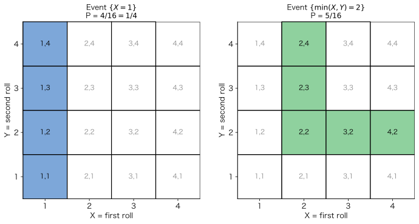
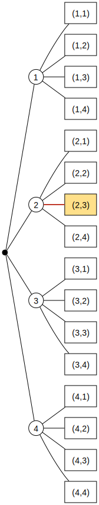
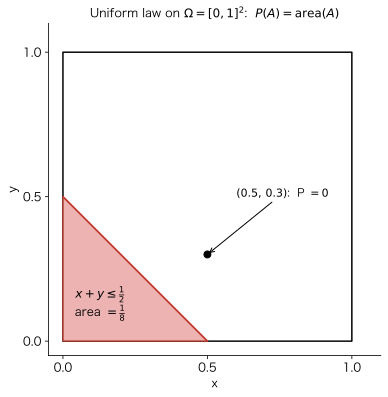

# 第 1 讲 — 概率模型与公理

> **课程:** MIT RES.6-012 《概率导论》(Tsitsiklis & Jaillet) · 教材 Bertsekas & Tsitsiklis,《Introduction to Probability》第 2 版,第 1 章
> **覆盖小节:** L01.1 – L01.10
> **资料来源:** 课程字幕 + 幻灯片(原版与手写批注版)+ 教材 §1.1–1.2

---

## 0. 本讲路线图

学完本讲,你将掌握一个**概率模型的全部要素**。所谓**概率模型**,是对*某个结果不确定的情境、现象或实验的定量描述*。搭建一个概率模型永远分**两步**:

1. **样本空间(sample space)** — 描述所有*可能的结果*。
2. **概率律(probability law)** — 描述我们对这些结果*发生可能性大小的信念*。

提纲:

- **样本空间** — 结果是什么,以及一份合格的结果清单必须满足的规则。
- **概率律** — **3 条公理**,以及由它们推出的众多**性质**。
- **例子** — 一个**离散**、一个**连续**。
- **讨论** — **可数可加性**,以及它所化解的**数学微妙之处**。
- **诠释** — “概率”这个词到底意味着什么。

> 💡 **本讲主线:** 公理*出奇地少*、*非常直观*,却*威力巨大* —— 本讲几乎所有其余内容,都是靠纯逻辑从这几条公理里“挤”出来的。

---

## 1. 样本空间 $\Omega$

**样本空间** $\Omega$ 是实验**所有可能结果构成的集合**。(请用*集合(set)*而非*清单(list)*一词,它带有我们需要的严格数学含义。)

其中的元素(结果)必须满足:

| 要求 | 含义 |
|---|---|
| **互斥(mutually exclusive)** | 至多只有一个结果发生。若我告诉你结果 $a$ 发生了,那么 $b\neq a$ 就**没有**发生。 |
| **完备(collectively exhaustive)** | 所有结果合在一起覆盖一切 —— *总有某个*结果发生。 |
| **粒度“恰当”** | 把你关心的细节纳入,把无关的细节舍弃。 |

> **一句话检验:** 实验结束后,你总能指着 $\Omega$ 中**唯一一个**元素说:*“就是这个结果发生了。”*

**粒度是一种建模选择。** 以掷一枚硬币为例:

- 最简模型:$\Omega=\{H,\,T\}$。
- 过度细化模型:$\Omega=\{(H,\text{雨}),(H,\text{无雨}),(T,\text{雨}),(T,\text{无雨})\}$。

两者都是*合法的*(互斥 + 完备)。四元素那个只是带了**无关细节**。优先选更简单的 $\{H,T\}$ —— **除非**你要回答的问题依赖天气(例如“天气会影响硬币吗?”),那时更细的样本空间才是恰当的。*选择细节层级是一切科学建模的共性。*

---

## 2. 样本空间的例子

样本空间是个*集合*,因此可以是**离散有限**、**离散无限**或**连续**的。

### 2a. 离散 / 有限 —— 掷两次四面骰

四面骰有 4 个面($1,2,3,4$)。掷**两次** —— 这是**一个**实验,内含两个阶段。记录数对 $(X,Y)$,其中 $X$ = 第一次结果,$Y$ = 第二次结果。

$$\Omega=\{(x,y): x,y\in\{1,2,3,4\}\}, \qquad |\Omega| = 4\times 4 = 16.$$

**次序有别:** $(2,3)$ 与 $(3,2)$ 是**不同**的结果。

同一个 $\Omega$ 的两种等价画法:

- **方格 / 二维表**(上图):16 个格子各对应一个结果。
- **顺序树(sequential tree)**(下图):只要实验含**阶段**(真实的或想象的)就很好用。**根(root)** 是起点,**叶(leaf)** 是结果。沿高亮路径“第一次 $=2$,再第二次 $=3$”走到叶 $(2,3)$。

两种描述都有 $16$ 个叶 / 格子 —— 是同一个样本空间。

### 2b. 连续 —— 单位正方形上的飞镖

向一个永远落在单位正方形内的靶投飞镖;以**无穷精度**记录落点 $(x,y)$($x,y$ 为实数)。于是

$$\Omega=\{(x,y): 0\le x\le 1,\ 0\le y\le 1\}=[0,1]^2,$$

这是一个**不可数无限**的连续样本空间。

---

## 3. 概率公理

现在进行第二步:赋予概率。**第一个困难:** 在连续模型里,击中*某个确切点*(比如正中心)的概率本质上是 $0$。所以我们**不**给单个结果赋概率,而是给**子集**赋概率。

> **事件(event)** = 样本空间 $\Omega$ 的一个*子集*。**概率赋予事件。** 实验结束后,若结果落在 $A$ 内,就说*“事件 $A$ 发生”*,否则*“$A$ 未发生”*。(单个点的概率可以是 $0$,而集合 —— 例如“正方形上半部分” —— 却有正概率。)

记号提示:$A\cap B$(“$A$ 且 $B$”)= 同时属于两者的元素;$A\cup B$(“$A$ 或 $B$”)= 属于其中任一者的元素;$\varnothing$ = 空集;$A,B$ **不相交(disjoint)** 当且仅当 $A\cap B=\varnothing$。

按惯例,概率取值于 $[0,1]$:$0\approx$“实际上不可能发生”,$1\approx$“实际上必然发生”。一个合法的概率律必须满足**三条公理**:

> ### 概率公理
> 1. **(非负性 Nonnegativity)** 对任意事件 $A$,$\;\mathbf P(A)\ge 0$。
> 2. **(归一化 Normalization)** $\;\mathbf P(\Omega)=1$。
> 3. **(可加性 Additivity)** 若 $A\cap B=\varnothing$,则 $\;\mathbf P(A\cup B)=\mathbf P(A)+\mathbf P(B)$。
>    *(将于 §7 加强为**可数**可加性。)*

**可加性的直觉。** 把概率想成**铺在 $\Omega$ 上的 1 磅“物质”**;$\mathbf P(A)$ 就是压在 $A$ 上方的物质有多少。对不相交的 $A,B$,$A\cup B$ 上方的物质就是($A$ 上方)+($B$ 上方)。

> **为什么没有一条公理写“$\mathbf P(A)\le 1$”?** 我们*不需要* —— 它(以及其他若干自然事实)都能从这三条公理**推出来**。公理少,推论多。

---

## 4. 公理的推论

下面所有结论都只用这三条公理(记为 **A** = 非负性、**B** = 归一化、**C** = 可加性)推出。

| 性质 | 表述 |
|---|---|
| 上界 | $\mathbf P(A)\le 1$ |
| 空集 | $\mathbf P(\varnothing)=0$ |
| 补集 | $\mathbf P(A)+\mathbf P(A^c)=1$ |
| 有限可加 | $A_1,\dots,A_k$ 两两不相交 $\Rightarrow \mathbf P\!\big(\bigcup_i A_i\big)=\sum_i \mathbf P(A_i)$ |
| 有限集 | $\mathbf P(\{s_1,\dots,s_k\})=\sum_{i}\mathbf P(s_i)$ |
| 单调性 | $A\subset B\Rightarrow \mathbf P(A)\le \mathbf P(B)$ |
| 容斥原理 | $\mathbf P(A\cup B)=\mathbf P(A)+\mathbf P(B)-\mathbf P(A\cap B)$ |
| **并集上界(union bound)** | $\mathbf P(A\cup B)\le \mathbf P(A)+\mathbf P(B)$ |
| 三集合并 | $\mathbf P(A\cup B\cup C)=\mathbf P(A)+\mathbf P(A^c\cap B)+\mathbf P(A^c\cap B^c\cap C)$ |

### 部分证明(每个都是从公理出发的“一行证明”)

**补集与上界。** 一个集合与它的补集不相交且覆盖整个 $\Omega$:
$$1\stackrel{\text{B}}{=}\mathbf P(\Omega)=\mathbf P(A\cup A^c)\stackrel{\text{C}}{=}\mathbf P(A)+\mathbf P(A^c)
\;\Rightarrow\; \mathbf P(A)=1-\underbrace{\mathbf P(A^c)}_{\ge 0\ (\text{由 A})}\le 1.$$

**空集。** 在上式中取 $A=\Omega$;由于 $\Omega^c=\varnothing$ 且 $\mathbf P(\Omega)=1$:
$\;\mathbf P(\varnothing)=1-\mathbf P(\Omega)=0$。

**三个不相交集合的可加性**(再用归纳法推广到 $k$ 个)。两两一组:
$$\mathbf P(A\cup B\cup C)=\mathbf P\big((A\cup B)\cup C\big)\stackrel{\text{C}}{=}\mathbf P(A\cup B)+\mathbf P(C)\stackrel{\text{C}}{=}\mathbf P(A)+\mathbf P(B)+\mathbf P(C).$$

**有限集的概率。** 把 $\{s_1,\dots,s_k\}=\{s_1\}\cup\cdots\cup\{s_k\}$ 写成不相交的单点集之并,再用有限可加性:
$$\mathbf P(\{s_1,\dots,s_k\})=\mathbf P(\{s_1\})+\cdots+\mathbf P(\{s_k\}).$$
*(记号简写:把 $\mathbf P(\{s_i\})$ 写作 $\mathbf P(s_i)$。)*

**单调性。** 若 $A\subset B$,把 $B=A\cup(A^c\cap B)$ 拆成不相交两块:
$$\mathbf P(B)=\mathbf P(A)+\underbrace{\mathbf P(A^c\cap B)}_{\ge 0}\ \ge\ \mathbf P(A).$$

**容斥原理。** 把 $A\cup B$ 拆成 3 个不相交的块,概率分别记为 $a=\mathbf P(A\cap B^c)$、$b=\mathbf P(A\cap B)$、$c=\mathbf P(A^c\cap B)$。则
$\mathbf P(A\cup B)=a+b+c$,而 $\mathbf P(A)+\mathbf P(B)-\mathbf P(A\cap B)=(a+b)+(b+c)-b=a+b+c$。✓
**并集上界**随之成立,因为 $\mathbf P(A\cap B)\ge 0$。

---

## 5. 离散例子(完整求解)

掷两次四面骰,**16 个结果等可能**,故每个的概率为 $\tfrac1{16}$。事件的概率靠**数数**求得(见 §2a 方格图):

- $\mathbf P(X=1)$ —— 第一次为 $1$:那一列共 $4$ 个格子 $\Rightarrow \dfrac{4}{16}=\dfrac14$。
- 令 $Z=\min(X,Y)$。
  - $\mathbf P(Z=4)$ —— 需要 $X=Y=4$:仅一个结果 $\Rightarrow \dfrac{1}{16}$。
  - $\mathbf P(Z=2)$ —— 一颗为 $2$,另一颗 $\ge 2$:结果有
    $(2,2),(2,3),(2,4),(3,2),(4,2)$,共 $5$ 个格子 $\Rightarrow \dfrac{5}{16}$。

> ### 离散均匀律(discrete uniform law)
> 若 $\Omega$ 有 $n$ 个**等可能**结果,则每个结果概率为 $1/n$(由归一化强制),且对任意事件 $A$,
> $$\boxed{\ \mathbf P(A)=\frac{A\ \text{的元素个数}}{n}=\frac{|A|}{n}\ }$$
> 于是求概率归结为**数数** —— 这正是后面要专门用一整讲来讲“计数”的原因。

*(一般离散律(未必均匀):$\mathbf P(\{s_1,\dots,s_n\})=\mathbf P(s_1)+\cdots+\mathbf P(s_n)$。)*

---

## 6. 连续例子(完整求解)

单位正方形 $\Omega=[0,1]^2$ 上的飞镖,采用**均匀律**:子集的概率**等于其面积**,
$$\mathbf P(A)=\operatorname{area}(A).$$
*(这是一个任意但合理的建模选择 —— 并无强制理由。)*

- **事件 $\{x+y\le \tfrac12\}$** 是直线 $x+y=\tfrac12$ 下方的三角形,两条直角边长均为 $\tfrac12$:
  $$\mathbf P\!\left(x+y\le\tfrac12\right)=\operatorname{area}=\tfrac12\cdot\tfrac12\cdot\tfrac12=\tfrac18.$$
- **单个点 $\{(0.5,0.3)\}$**:一个点的面积为 $0$,故 $\mathbf P=0$。*任意*单个点都如此 —— 然而整个正方形的概率是 $1$。(这一张力将在 §7 化解。)

> ### 任意概率计算的四步法
> 1. **样本空间** —— 写出 $\Omega$。
> 2. **概率律** —— 指定它*(带有一定任意性;挑一个能贴合现实的)*。
> 3. **识别事件** —— 把(常常含糊的)文字描述翻译成子集;**画图。**
> 4. **计算** $\mathbf P(\text{事件})$。
>
> 系统地走完这四步,总能得到唯一正确答案。*画图极其有用。*

---

## 7. 可数可加性与数学微妙之处

### 一个离散但*无限*的样本空间

反复掷硬币;结果 = **首次出现正面所需的投掷次数**。任意正整数都可能,故 $\Omega=\{1,2,3,\dots\}$ 是**无限**的。设单点律为
$$\mathbf P(n)=\frac{1}{2^{\,n}},\qquad n=1,2,3,\dots$$

**合理性检验(它们的和是 1 吗?):**
$$\sum_{n=1}^{\infty}\frac{1}{2^n}=\frac12\sum_{n=0}^{\infty}\frac{1}{2^n}=\frac12\cdot\frac{1}{1-\tfrac12}=1.\ \checkmark$$

**一个一般事件,如“结果为偶数”:**
$$\mathbf P(\text{偶数})=\mathbf P(\{2\}\cup\{4\}\cup\{6\}\cup\cdots)=\sum_{k=1}^{\infty}\frac{1}{2^{2k}}
=\frac14\cdot\frac{1}{1-\tfrac14}=\frac13.$$

但这一步对**无穷多个**不相交集合用了可加性 —— 而公理 3(有限可加)并**不**涵盖这种情形。我们*希望*允许这样算,于是把公理**加强**:

> ### 公理 3′ —— 可数可加性(取代有限可加性)
> 若 $A_1,A_2,A_3,\dots$ 是一个**两两不相交事件的无穷*序列*(sequence)**,则
> $$\mathbf P\!\left(\bigcup_{i=1}^{\infty}A_i\right)=\sum_{i=1}^{\infty}\mathbf P(A_i).$$
> 关键词是**序列**:这些事件必须能排成第 1 个、第 2 个、第 3 个……

### 为什么“序列”至关重要 —— $1=0$ 的“悖论”

在单位正方形(面积律)上,把整个正方形写成其所有单点之并:
$$\Omega=\bigcup_{\text{点 }p}\{p\},\qquad \mathbf P(\{p\})=0.$$
若可以这样“相加”:$\mathbf P(\Omega)=\sum 0 = 0$。但归一化说 $\mathbf P(\Omega)=1$。于是 $1=0$?!

**化解:** 可数可加性**只**适用于一个***序列***。单位正方形里的点**无法**排成序列 —— 正方形是**不可数(uncountable)** 的。非法的那一步,是把不可数并当成可数并来处理。并无矛盾。

### 可数 vs 不可数无限集

> - **可数(countable)** = 能与正整数建立一一对应(能排成序列)。例:$\mathbb N$、整数 $\mathbb Z$、**整数对**、**有理数** $\mathbb Q\cap(0,1)$。
> - **不可数(uncountable)** = 不可数的。例:区间 $[0,1]$、实数轴 $\mathbb R$、平面。

**实数是不可数的 —— 康托尔对角线论证(梗概)。** 假设 $\{x\in(0,1):$ 十进制展开只用数字 $3,4\}$ 可数,排成 $x_1,x_2,x_3,\dots$。构造 $x$,令其第 $i$ 位与 $x_i$ 的第 $i$ 位**不同**(把 $3\!\leftrightarrow\!4$ 互换)。于是对**每个** $i$ 都有 $x\neq x_i$,但 $x$ 又在该集合中 —— 矛盾。故这样的列表不存在。

> **测度论提醒(本课程不必担心)。** “面积”真是合法的概率律吗 —— 它满足可数可加性吗?是的,**只要我们只处理“良好(nice)”的子集。** 病态的不可测集确实存在,但我们在本课中永远不会遇到。这些微妙之处真实存在,但都能被严格处理(这门学问叫**测度论**)。

---

## 8. 概率的诠释

$\mathbf P(A)$ 这个数到底*意味着*什么?

- **作为一门数学。** 从公理出发,推出定理 —— 你大可从不追问“概率”究竟*是什么意思*。
- **频率诠释(frequency)。** 后面会有定理:把一枚均匀硬币掷无穷多次,**正面出现的比例 → ½**。所以 $\mathbf P(A)$ ≈ 在大量独立重复中 $A$ 的长期频率。对掷硬币很自然。
- **信念诠释(belief)。** “总统在下次选举中以概率 $0.7$ 连任” —— 并不存在“下次选举的无穷次重复”。这里概率编码的是一种**信念程度**,例如你愿意下的**赌注**。
- **客观还是主观?** 信念听起来主观,但概率至少给出了**对不确定性进行一致推理的规则**。若你的模型与现实世界相关联,它就成为做出**预测与决策**的有力工具 —— 而预测决策的好坏,取决于你的模型有多好。

**现实世界 ⇄ 统计 ⇄ 概率。** 统计从数据中挑选模型,概率则分析模型以做出预测:

---

## 9. 速查公式表

**模型** = $(\Omega,\ \mathbf P)$:样本空间 + 概率律。

**公理。** (A) $\mathbf P(A)\ge0$ · (B) $\mathbf P(\Omega)=1$ · (C) 不相交序列 $\Rightarrow \mathbf P\big(\bigcup_i A_i\big)=\sum_i \mathbf P(A_i)$。

**推论。**
$$\mathbf P(\varnothing)=0,\quad \mathbf P(A)\le1,\quad \mathbf P(A^c)=1-\mathbf P(A),\quad A\subset B\Rightarrow\mathbf P(A)\le\mathbf P(B),$$
$$\mathbf P(A\cup B)=\mathbf P(A)+\mathbf P(B)-\mathbf P(A\cap B),\qquad \mathbf P(A\cup B)\le\mathbf P(A)+\mathbf P(B)\ \text{(并集上界)}.$$

**离散律:** $\mathbf P(\{s_1,\dots,s_n\})=\sum_i\mathbf P(s_i)$。
**离散均匀:** $\mathbf P(A)=|A|/|\Omega|$。
**$[0,1]^2$ 上连续均匀:** $\mathbf P(A)=\operatorname{area}(A)$;单个点的概率为 $0$。

**几何级数:** $\displaystyle\sum_{i=0}^{\infty}\alpha^i=\frac{1}{1-\alpha}\ (|\alpha|<1)$。

---

## 10. 自测题

1. 写出三条公理。哪个自然性质**不是**公理,却能由它们推出?
2. 为什么 $\Omega$ 中的结果必须既互斥*又*完备?
3. 对两次掷骰,求 $\mathbf P(\max(X,Y)=2)$ 与 $\mathbf P(X+Y=5)$。
   *(答案:$3/16$;$4/16=1/4$。)*
4. 在单位正方形上,求 $\mathbf P(\,\max(x,y)\le \tfrac12\,)$ 与 $\mathbf P(x\ge y)$。
   *(答案:$1/4$;$1/2$。)*
5. 为什么“$\Omega=\bigcup\{\text{点}\}$ 因此 $1=0$”的论证不成立,而“$\mathbf P(\text{偶数})=1/3$”的论证却成立?
6. 举一个用**信念**诠释比用**频率**诠释更恰当的量。

---

## 附录 —— 数学背景

*(配套的“数学背景”幻灯片 —— 公理与 §7 所依赖的工具箱。)*

### A1. 集合

**集合**是**互异**元素的汇集:$\{a,b,c,d\}$(有限)、$\mathbb R$(无限),或由规则给出 $\{x\in\mathbb R: \cos x>\tfrac12\}$。

- $x\in S$ / $x\notin S$;**全集** $\Omega$;**空集** $\varnothing$,有 $\Omega^c=\varnothing$。
- **补集:** $x\in S^c \iff x\in\Omega,\ x\notin S$;且 $(S^c)^c=S$。
- **子集:** $S\subset T$ 表示 $x\in S\Rightarrow x\in T$。($S\subset T$ 且 $T\subset S \Rightarrow S=T$。)

### A2. 并与交

$$x\in S\cup T \iff x\in S\ \text{或}\ x\in T,\qquad x\in S\cap T \iff x\in S\ \text{且}\ x\in T.$$
对带指标的族 $S_n\ (n=1,2,\dots)$:
$$x\in\bigcup_n S_n \iff \text{存在某个 }n\text{ 使 }x\in S_n,\qquad
x\in\bigcap_n S_n \iff \text{对所有 }n\text{ 都有 }x\in S_n.$$

**集合恒等式:** 交换律($S\cup T=T\cup S$)、结合律、分配律($S\cap(T\cup U)=(S\cap T)\cup(S\cap U)$,$S\cup(T\cap U)=(S\cup T)\cap(S\cup U)$);另有 $(S^c)^c=S$、$S\cup\Omega=\Omega$、$S\cap\Omega=S$、$S\cap S^c=\varnothing$。

### A3. 德摩根定律(De Morgan's laws)

$$(S\cap T)^c=S^c\cup T^c,\qquad (S\cup T)^c=S^c\cap T^c,$$
一般地
$$\Big(\bigcap_n S_n\Big)^c=\bigcup_n S_n^c,\qquad \Big(\bigcup_n S_n\Big)^c=\bigcap_n S_n^c.$$

### A4. 序列与极限

序列 $a_1,a_2,\dots$ 是函数 $f:\mathbb N\to S$,$f(i)=a_i$。

$$a_i\to a\ (\text{即 }\textstyle\lim_{i\to\infty}a_i=a)\iff
\forall\,\varepsilon>0\ \exists\, i_0:\ i\ge i_0\Rightarrow |a_i-a|\le\varepsilon.$$

- **极限的代数:** $a_i\to a,\ b_i\to b\Rightarrow a_i+b_i\to a+b,\ a_ib_i\to ab$。
- **连续性:** $g$ 连续且 $a_i\to a\Rightarrow g(a_i)\to g(a)$(例如 $a_i^2\to a^2$)。
- **收敛判据。** **单调**序列($a_i\le a_{i+1}$)要么收敛到一个实数,要么“收敛到 $\infty$”。**夹逼:** 若 $|a_i-a|\le b_i$ 且 $b_i\to0$,则 $a_i\to a$。

### A5. 无穷级数

$$\sum_{i=1}^{\infty}a_i=\lim_{n\to\infty}\sum_{i=1}^{n}a_i\quad(\text{当极限存在时}).$$

- 若**全部 $a_i\ge0$**,极限必存在(可能为 $+\infty$)。
- 若各项**正负混合**,极限可能不存在,或**随求和次序而变**。
- **事实:** 当**绝对收敛**($\displaystyle\sum_{i=1}^{\infty}|a_i|<\infty$)时,极限存在**且与次序无关**。同一条件($\sum|a_{ij}|<\infty$)允许**交换双重和的次序**:$\sum_i\sum_j a_{ij}=\sum_j\sum_i a_{ij}$。

### A6. 几何级数(等比级数)

$$\boxed{\ \sum_{i=0}^{\infty}\alpha^i=1+\alpha+\alpha^2+\cdots=\frac{1}{1-\alpha}\quad(|\alpha|<1)\ }$$

**推导。** 由 $(1-\alpha)(1+\alpha+\cdots+\alpha^n)=1-\alpha^{n+1}$,令 $n\to\infty$(于是 $\alpha^{n+1}\to0$):$(1-\alpha)S=1\Rightarrow S=\dfrac{1}{1-\alpha}$。

### A7. 可数 vs 不可数(§7 回顾)

**可数**(能排成序列):$\mathbb N$、$\mathbb Z$、整数对、$\mathbb Q$。**不可数:** $[0,1]$、$\mathbb R$、平面(康托尔对角线论证)。这正是**可数可加性要针对事件*序列*来陈述**的原因。

---

本笔记综合自 L01.1–L01.10 字幕及配套幻灯片/教材(Bertsekas & Tsitsiklis,《Introduction to Probability》第 2 版 §1.1–1.2;MIT RES.6-012)。图形在本地渲染至 `assets/`。英文原版见 [Lecture-01-Probability-Models-and-Axioms.md](Lecture-01-Probability-Models-and-Axioms.md)。
